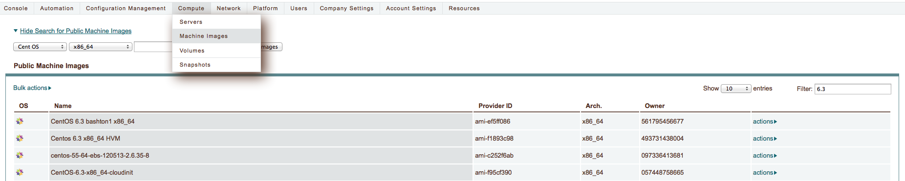
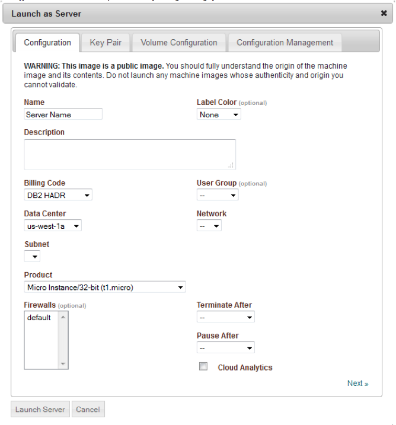
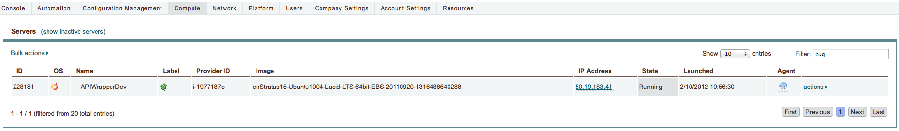

RHEL / CentOS
-------------

To install the enStratus agent on a RHEL / CentOS instance, use the following steps:

Launch an Instance
~~~~~~~~~~~~~~~~~~

In the enStratus console, go to Compute > Machine Images. Once you have located the image you wish to launch, select Launch from the actions menu.

   Launch CentOS / RHEL Instance

Specify appropriate properties for your server and click Launch Server. 

.. note:: If you are using the Amazon cloud, do not specify a key pair.

   Launch RHEL / CentOS Instance

.. warning:: The screenshot shows the server being launched with a size: micro. Please use
   at least a small size (or equivalent) product offering. (768Mb Memory)
   

Configure Agent
~~~~~~~~~~~~~~~  

Step 1:  Install Pre-requisites and Download the agent

.. code-block:: bash

	yum update -y && yum install java-1.6.0-openjdk java-1.6.0-openjdk-devel sudo -y
	
	iptables -I INPUT -p tcp --dport 2003 -j ACCEPT
	
	/etc/init.d/iptables save
	
	export JAVA_HOME=/usr/lib/jvm/java-1.6.0-openjdk-1.6.0.0.x86_64/
	
	mkdir /mnt/tmp
	
	chown enstratus:enstratus /mnt/tmp
	
	wget http://es-download.s3.amazonaws.com/enstratus-agent-centos-latest.tar.gz
	
	tar -zxvf enstratus-agent-centos-latest.tar.gz
	
	cd /enstratus

Step 2:  Install the agent	

The install script allows you to pass the Cloud/Platform to the agent from the command line. 

Example:  If you were going to connect an Amazon VM to the enStratus SaaS, you would use:

.. code-block:: bash

	./install.sh Amazon production

However, if you were using an on-premise version against <CLOUD PROVIDER> you would use:

.. code-block:: bash

	./install.sh <CLOUD PROVIDER> <environment> <dispatcher ip>:3302
	
Where <CLOUD PROVIDER> is a cloud provider of the list below:

.. hlist::
   :columns: 3

   * Amazon
   * Atmos
   * ATT
   * Azure
   * CloudCentral
   * CloudSigma
   * CloudStack
   * Eucalyptus
   * GoGrid
   * Google
   * Nimbula
   * OpenStack
   * Rackspace
   * Savvis
   * ServerExpress
   * Terremark
   * VMware

Where <ENVIRONMENT> is either:

1. **production** - should be used by SaaS (cloud.enstratus.com) customers
2. **staging** - should be used by on-premise customers using self-signed_certificates

Verifying Agent Connectivity
~~~~~~~~~~~~~~~~~~~~~~~~~~~~

The best place to start is to always look at the logs:

Agent Log:  /enstratus/ws/tomcat/logs/catalina.out

On-premise Logs:  /services/dispatcher/tomcat/logs/catalina.out

The next place is to verify that an icon appears within the enStratus console that shows connectivity.  Then by clicking actions -> logs to verify that the LOGGER functionality is successfully being sent from the VM to the agent and then to the console.

   Agent Running
   

