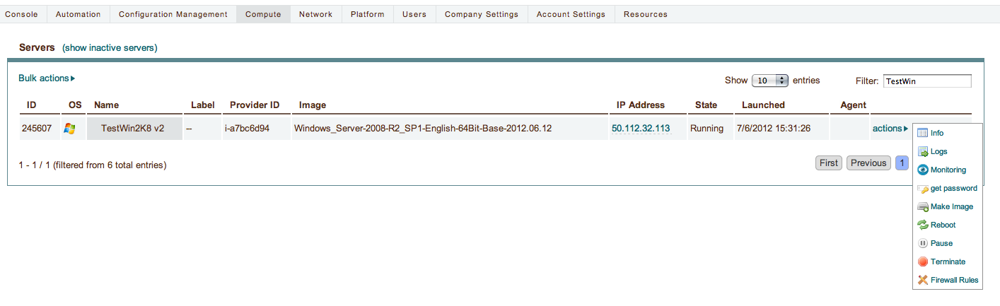
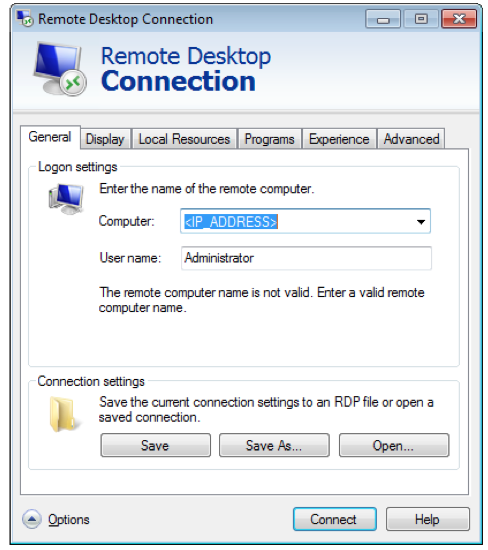
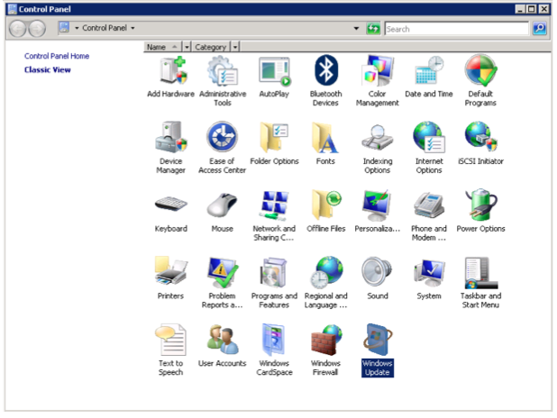
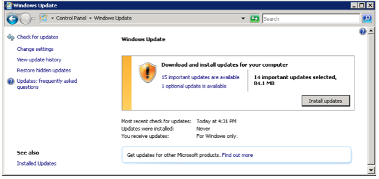
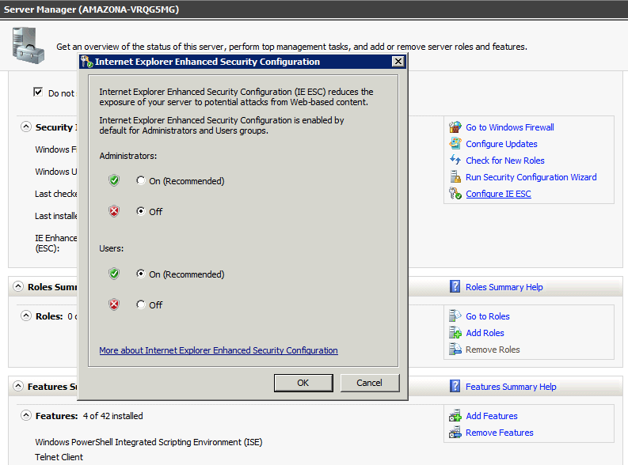
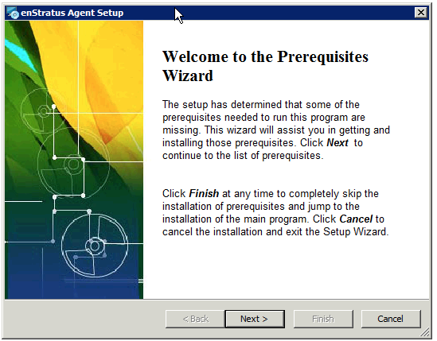
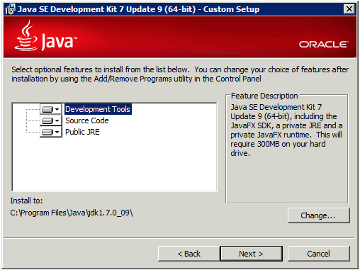
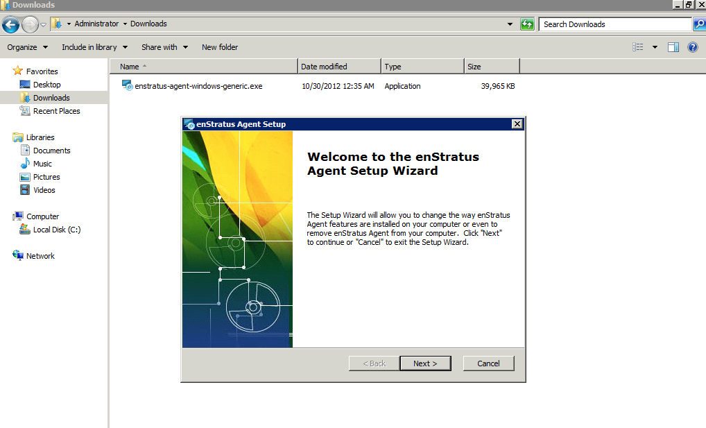
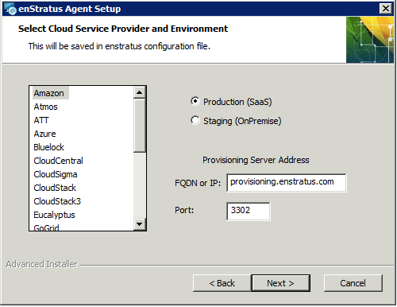
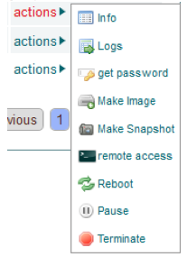

Windows
-------

To install the enStratus agent on a Windows instance, follow the steps below:

Launch an Instance
~~~~~~~~~~~~~~~~~~

In the enStratus console, go to Compute > Machine Images. Once you have located the image
you wish to launch, select Launch from the actions menu.

.. figure:: ./images/2008_1.png
   :height: 330px
   :width: 1381 px
   :scale: 65 %
   :alt: Launch 2008 Instance
   :align: center

   Launch 2008 Instance

Specify appropriate properties for your server and click Launch Server. 

.. note:: If you are using the Amazon cloud, do not specify a key pair.

.. figure:: ./images/2008_2.png
   :height: 717 px
   :width: 668 px
   :scale: 65 %
   :alt: Launch 2008 Instance
   :align: center

   Launch 2008 Instance

.. warning:: The screenshot shows the server being launched with a size: micro. Please use
   at least a small size (or equivalent) product offering. (768Mb Memory)

RDP to the Server
~~~~~~~~~~~~~~~~~

In Compute > Servers, go to the actions menu for the server you just created and click
get password. 

.. note:: You may have to wait up to 20 minutes after creating the server before
   get password appears in the actions menu.

   Server Actions, Get Password

RDP to the instance as the Administrator user with the password you just retrieved. Note:
If your firewall isn’t already configured for RDP access, you will need to do so before
connecting. The default port for RDP is 3389.

   RDP

Make sure your internet connection is working

Open up Internet Explorer by going to Start > Internet Explorer.

Update Windows
~~~~~~~~~~~~~~

1. Click Start, click Control Panel 
2. Open Windows Update

   Update Windows

3. Download and install the latest updates

   Update Windows

Change the Security Configuration
~~~~~~~~~~~~~~~~~~~~~~~~~~~~~~~~~

To download the agent installer, you need to change the Internet Explorer Enhanced Security Configuration.

1. Open Server Manager.
2. Click 'Configure IE ESC'.
3. Turn off the security confiuration for Administrators.

   Internet Explorer Enhanced Security Configuration

.. note:: If you concern the server's security, you need to turn on the option again after finishing the download.

Download the Agent Installer
~~~~~~~~~~~~~~~~~~~~~~~~~~~~

Refer to the Agent Downloads section.

Install the Agent
~~~~~~~~~~~~~~~~~

1. Run the installer. It is normally saved in 'Downloads' directory by default.

2. If you don't have JDK installed on a new server instance, the installer will show the Prerequisites Wizard to guide you to install JDK from Oracle website. The enStratus Agent for Windows is dependent on Oracle JDK 7. Please download the suitable version of JDK and install it.

   Prerequisites Wizard

   JDK installation

3. After installing JDK, you can proceed to the next step.

   Welcome to enStratus Agent Setup Wizard

4. Installer will show you interactive dialogues to generate a configuration file. Please select the proper options in accordance with the information of your cloud service proviers.

   Configuration Options Dialogue

.. list-table::
   :widths: 20 120

   * - production
     - should be used by SaaS (cloud.enstratus.com) customers
   * - staging
     - should be used by on-premise customers using self-signed_certificates

5. Also, it will check if you have prerequisite programs such as Powershell community extensions on the server and install the programs automatically.

6. You will see the agent icon from enStratus console after completing the installation.

   .. note:: It will take a few minutes for the agent to show up in the enStratus console.

Confirming the Installation
~~~~~~~~~~~~~~~~~~~~~~~~~~~

Go to your enStratus web console, and open up the Compute > Servers page.

You should now see the “remote access” option if the agent has installed properly. Click on it.

   Confirming Agent Installation

Select your account and click “Save”. After a few seconds, the account will show up at the top of the list.

.. figure:: ./images/2008_13.png
   :height: 160 px
   :width: 666 px
   :scale: 95 %
   :alt: Launch 2008 Instance
   :align: center

   Launch 2008 Instance

You can now RDP into the server. The enStratus agent is installed and working normally.

