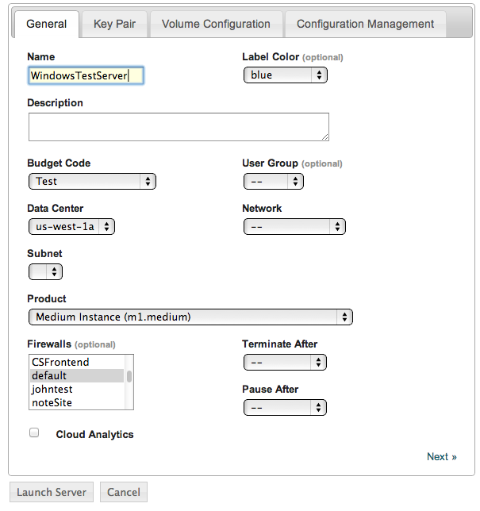
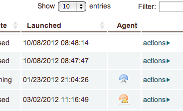

Windows
-------

To install the enStratus agent on a Windows instance, follow the steps below:

Launch an Instance
~~~~~~~~~~~~~~~~~~

In the enStratus console, go to Compute > Machine Images. Once you have located the image
you wish to launch, select Launch from the actions menu.

.. figure:: ./images/2008_1.png
   :height: 330px
   :width: 1381 px
   :scale: 65 %
   :alt: Launch Instance
   :align: center

Specify appropriate properties for your server and click Launch Server. 

.. warning:: If you are using the Amazon cloud, do not specify a key pair.

.. note:: For optimal performance, use at least a small size (or equivalent) 
 product offering. (768Mb Memory)

RDP to the Server
~~~~~~~~~~~~~~~~~

In Compute > Servers, go to the actions menu for the server you just created and click
get password. 

.. note:: You may have to wait up to 20 minutes after creating the server before
   get password appears in the actions menu.

.. figure:: ./images/2008_3.png
   :height: 433px
   :width: 1414 px
   :scale: 65 %
   :alt: Server Actions, Get Password
   :align: center

RDP to the instance as the Administrator user with the password you just retrieved. 

.. note::
 If your firewall isn’t already configured for RDP access, you will need to do so before
 connecting. The default port for RDP is 3389.

.. figure:: ./images/2008_4.png
   :height: 550px
   :width: 488 px
   :scale: 75 %
   :alt: RDP
   :align: center

Confirm that your internet connection is working:

Open up Internet Explorer by going to Start > Internet Explorer.

Update Windows
~~~~~~~~~~~~~~

1. Click Start, click Control Panel 
2. Open Windows Update

.. figure:: ./images/2008_6.png
   :height: 464px
   :width: 618 px
   :scale: 85 %
   :alt: Update Windows
   :align: center

3. Download and install the latest updates

.. figure:: ./images/2008_7.png
   :height: 292px
   :width: 618 px
   :scale: 85 %
   :alt: Update Windows
   :align: center

Change the Security Configuration
~~~~~~~~~~~~~~~~~~~~~~~~~~~~~~~~~

To download the agent installer, you need to change the Internet Explorer Enhanced Security Configuration.

1. Open Server Manager.
2. Click 'Configure IE ESC'.
3. Turn off the security confiuration for Administrators.

.. figure:: ./images/IEESC.png
   :height: 588 px
   :width: 793 px
   :scale: 75 %
   :alt: Internet Explorer Enhanced Security Configuration
   :align: center

.. note:: Depending on your organization's security policies, you may want to turn on this option again after finishing the download.

Download the Agent Installer
~~~~~~~~~~~~~~~~~~~~~~~~~~~~

Refer to the Agent Downloads section.

Install the Agent
~~~~~~~~~~~~~~~~~

1. Run the installer. It is saved in the 'Downloads' directory by default.

2. If you don't have JDK installed on the server instance, the installer will show the Prerequisites Wizard to guide you to install 
JDK from Oracle's website. The enStratus Agent for Windows is dependent on Oracle JDK 7. Please download the suitable version of the JDK and install it.

.. figure:: ./images/prerequisite_wizard.png
   :height: 429 px
   :width: 549 px
   :scale: 85 %
   :alt: Prerequisites Wizard
   :align: center

   Prerequisites Wizard

.. figure:: ./images/JDK_install.png
   :height: 381 px
   :width: 508 px
   :scale: 85 %
   :alt: JDK installation
   :align: center

   JDK Installation

3. After installing the JDK, you can proceed to the next step.

.. figure:: ./images/install_start.png
   :height: 617 px
   :width: 1018 px
   :scale: 85 %
   :alt: Welcome to installer.
   :align: center

4. The installer will show you interactive dialogues to generate a configuration file. Select the proper options for your cloud service provider.

.. figure:: ./images/configuration_options.png
   :height: 386 px
   :width: 500 px
   :scale: 85 %
   :alt: Configuration Options Dialogue
   :align: center

.. list-table::
   :widths: 20 120

   * - production
     - should be used by SaaS (cloud.enstratus.com) customers
   * - staging
     - should be used by on-premise customers using self-signed_certificates

5. The installer will also check whether you have prerequisite programs such as Powershell community extensions on the server and install them automatically.

6. You will see the agent icon in the enStratus console after completing the installation.

.. note:: It will take a few minutes for the agent to appear in the enStratus console.

Confirming the Installation
~~~~~~~~~~~~~~~~~~~~~~~~~~~

Go to your enStratus web console, and open up the Compute > Servers page.

You should now see the “remote access” option if the agent has installed properly. Click on it.

.. figure:: ./images/2008_12.png
   :height: 285 px
   :width: 207 px
   :scale: 85 %
   :alt: Confirming Agent Installation
   :align: center

Select your account and click “Save”. After a few seconds, the account will show up at the top of the list.

.. figure:: ./images/2008_13.png
   :height: 160 px
   :width: 666 px
   :scale: 95 %
   :alt: Launch 2008 Instance
   :align: center

You can now RDP into the server. The enStratus agent is installed and working normally.

