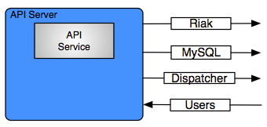

API
===

The enStratus console is a tomcat service installed to /services/api.

   API Service Connections

Starting API
------------

.. code-block:: bash

	/etc/init.d/enstratus-api start

There should be a java process listening on port 15000, for a default installation.

.. code-block:: bash

  netstat -tnlup | grep java
  tcp6       0      0 :::15000                :::*                    LISTEN      5647/java       
  tcp6       0      0 127.0.0.1:16099         :::*                    LISTEN      5647/java  

Stopping API
------------

.. code-block:: bash

	/etc/init.d/enstratus-api stop

Configuration Files
-------------------

The enStratus api service has 6 configuration files

.. hlist::
   :columns: 2

   * tomcat
   * enstratus
   * context.xml
   * enstratus-webservices.cfg
   * dasein-persistence.properties
   * networks.cfg

tomcat
~~~~~~

Path:

  ``/services/api/bin/tomcat``

This file is responsible for controlling the start of the API service. Any
JAVA_OPTS that need to be passed to the API tomcat service can be done using this
file.

enstratus
~~~~~~~~~

Path:

  ``/services/api/bin/enstratus``

This file is responsible setting the user that is used to run the tomcat service, along
with the installation directory of the API service.

context.xml
~~~~~~~~~~~

Path:

  ``/services/api/tomcat/webapps/ROOT/META-INF/context.xml``

This file controls how the API service connects to its associated databases:
console and enstratus_console.

enstratus-webservices.cfg
~~~~~~~~~~~~~~~~~~~~~~~~~

Path:

  ``/services/api/tomcat/webapps/ROOT/WEB-INF/classes/enstratus-webservices.cfg``

This file defines the webservices endpoints for the API service to connect to the
enStratus dispatcher service.

dasein-persistence.properties
~~~~~~~~~~~~~~~~~~~~~~~~~~~~~

Path:

  ``/services/api/tomcat/webapps/ROOT/WEB-INF/classes/dasein-persistence.properties``

This file defines the connection to the dasein persistence layer of enStratus. It also
specifies the connection point to the Riak database service.

networks.cfg
~~~~~~~~~~~~

Path:

  ``/services/api/tomcat/webapps/ROOT/WEB-INF/classes/custom/networks.cfg``

This file is a general control point for several items, the most important of which is the
encryption key for encrypting connections to the dispatcher web services.

