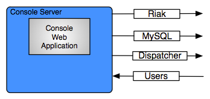

Console
=======

The enStratus console is a tomcat service installed to /services/console.

   Console Service Connections

Console Overview
----------------

The enStratus console service is a tomcat service that provides the web front-end, or
enStratus user console. The enStratus console is a content management system designed to
provide users with a means to interact with multiple clouds through a single interface.

The enStratus console listens on port 443 for https connections and connects to the
enStratus dispatcher service via a webservices call to initiate user actions.

The tomcat service providing the enStratus console can be load balanced by load balancing
software such as Apache, HA-Proxy, F5, nginx, among others.

The enStratus console service currently depends on 3 databases:

#. console
#. enstratus_console
#. Riak

In the near future, these three databases will be merged into one: Riak.

console Database
----------------

The enStratus console database contains the content for driving the web interface of the
enStratus console. 

enstratus_console Database
--------------------------

The enstratus_console database is primarily engaged in user management and contains
information related to users and accounts.

Riak
----

The Riak database service is assuming both of the responsibilities currently being
performed by the console and enstratus_console database.

Installation
------------

Installation of the enStratus console service is best handled by using a configuration
management system such as Chef or Puppet.

Software Requirements
---------------------

The dispatcher service depends on the Java 6 Java Development Kit (JDK) provided by
Oracle, along with the associated Java Cryptographic Extensions (JCE).

The JDK is installed to /usr/local/jdk and the jce jars are installed to /usr/local/jdk/security/lib.

Incoming Connections
--------------------

#. Users

   The only incoming connections handled by the enStratus console service are those
   initiated by users interacting with the enStratus console.

Outgoing Connections
--------------------

#. Dispatcher

   The console service interacts with the dispatcher service via a webservices call
   configured in the file:

  /services/console/tomcat/webapps/ROOT/WEB-INF/classes/enstratus-webservices.cfg

  This communication is encrypted using industry standard AES-256 encryption.

#. Riak and MySQL

Starting Console
----------------

To start the console service:

.. code-block:: bash

	/etc/init.d/enstratus-console start

Console Start Process
~~~~~~~~~~~~~~~~~~~~~

The console init script performs the following action:

#. Executes /services/console/bin/tomcat, passing it the argument: start. This starts the console process.

Stopping Console
----------------

To stop the console service:

.. code-block:: bash

	/etc/init.d/enstratus-console stop

Console Stop Process
~~~~~~~~~~~~~~~~~~~~

The console init script performs the following action:

#. Executes /services/console/bin/tomcat, passing it the argument: stop. This stops the console process.

Logging
-------

Logging for the enStratus console service is done to
/services/console/tomcat/logs/catalina.out and is controlled by
/services/console/tomcat/webapps/ROOT/WEB-INF/classes/log4j.{xml,properties}

Backups
-------

Service
~~~~~~~

The enStratus console service files should be backed up before and after any changes, and
once/day during steady-state operations. Backups should be performed on /services/console.
An example of a backup is shown here, excluding the log files in this case.

.. code-block:: bash

   cd /services/console/
   tar -czf /consoleService.tar.gz --exclude='tomcat/logs/*' . > /dev/null 2>&1

Databases
~~~~~~~~~

The frequency with which the enStratus console database is backed up is determined
primarily by the number of writes being made to the database. enStratus environments where
there are many new accounts being joined to enStratus, many new users being added or
modified should conduct backups more frequently than environments where these events are
less frequent.

As a general best practice guideline, backups should be done no less frequent than twice
daily, every four hours in heavily utilized systems, or more frequently as the situation
dictates.

Backups should be encrypted and stored in a geographically unique location from the
primary data source.

The expected time to run a backup of the console database can vary greatly. In
enStratus deployments that have been running for a very long period of time, the backup
may take between 2 and 5 minutes.

The expected time to restore the console database can vary depending on the length of
time of the existence of the provisioning database, the amount of hardware backing the db,
and the amount of data contained. Restoration may take over an hour, but probably less.

The same principles apply for the enstratus_console database, although it typically has less
information in it than the provisioning database. Expect backups and restoration of the
enstratus_console database to take less than one minute.

An example of how to run a backup of databases is shown in this script:

.. code-block:: bash

   #!/bin/bash
   
   #
   # Setup configuration values
   #
   HOST=$(hostname)
   USER=dbuser
   PASSWORD=abcdef12345
   DA=$(date +%Y%m%d-%H%M%S)
   MYSQL=/usr/bin/mysql
   MYSQLDUMP=/usr/bin/mysqldump
   GZIP=/bin/gzip
   PGP=/usr/bin/gpg
   
   CONFIG=/etc/mysql/my.cnf
   
   if [ $# -gt 0 ] ; then
     CONFIG=$1
   fi
   
   BASE=$(basename ${CONFIG} .cnf)
   LOGFILE=/var/log/backups-${BASE}.log
   DATABASES=$(${MYSQL} --defaults-file=${CONFIG} -u${USER} -p${PASSWORD} -Bse 'show databases')
   DIR=/backups/db
   
   echo "" >> ${LOGFILE}
   echo "Starting MySQL database backup for ${DA}..." >> ${LOGFILE}
   
   # 
   # Make sure the directory exists
   #
   if [ ! -d ${DIR} ] ; then
       mkdir ${DIR}
       chmod 700 ${DIR}
       chown enstratus ${DIR}
   fi
   
   # 
   # Delete all old files
   #
   find ${DIR} -type f -mtime +2 | xargs rm -f
   
   #
   # Backup each database
   #
   for db in ${DATABASES}
   do
       sleep 10
       NOW=$(date +%Y%m%d-%H%M%S)
       echo -n "        Backing up: ${db} at ${NOW}... " >> ${LOGFILE}
       FILE=${DIR}/${db}-${DA}.sql.gpg.gz
       $MYSQLDUMP --defaults-file=${CONFIG} --single-transaction -u${USER} -p${PASSWORD} $db | $PGP -r enstratusBackup@enstratus.com -e | $GZIP -9 > ${FILE}
       chown enstratus ${FILE}
       chmod 700 ${FILE}
       NOW=$(date +%Y%m%d-%H%M%S)
       echo "Done at ${NOW}." >> ${LOGFILE}
   done
   
   echo "MySQL database backup complete at ${NOW}." >> ${LOGFILE}
   echo "" >> ${LOGFILE}

Configuration Files
-------------------

The enStratus console service has 7 configuration files

.. hlist::
   :columns: 3

   * tomcat
   * enstratus
   * context.xml
   * enstratus-webservices.cfg
   * dasein-persistence.properties
   * enstratus-console.cfg
   * custom/networks.cfg

tomcat
~~~~~~

Path:

  ``/services/console/bin/tomcat``

This file is responsible for controlling the start of the console service. Any
JAVA_OPTS that need to be passed to the console tomcat service can be done using this
file.

enstratus
~~~~~~~~~

Path:

  ``/services/console/bin/enstratus``

This file is responsible setting the user that is used to run the tomcat service, along
with the installation directory of the console service.

context.xml
~~~~~~~~~~~

Path:

  ``/services/console/tomcat/webapps/ROOT/META-INF/context.xml``

This file controls how the console service connects to its associated databases:
console and enstratus_console.

enstratus-webservices.cfg
~~~~~~~~~~~~~~~~~~~~~~~~~

Path:

  ``/services/console/tomcat/webapps/ROOT/WEB-INF/classes/enstratus-webservices.cfg``

This file defines the webservices endpoints for the console service to connect to the
enStratus dispatcher service.

dasein-persistence.properties
~~~~~~~~~~~~~~~~~~~~~~~~~~~~~

Path:

  ``/services/console/tomcat/webapps/ROOT/WEB-INF/classes/dasein-persistence.properties``

This file defines the connection to the dasein persistence layer of enStratus. It also
specifies the connection point to the Riak database service.

enstratus-console.cfg
~~~~~~~~~~~~~~~~~~~~~

Path:

  ``/services/console/tomcat/webapps/ROOT/WEB-INF/classes/enstratus-console.cfg``

This file is used to define the url to which the console will respond.

custom/networks.cfg
~~~~~~~~~~~~~~~~~~~

Path:

  ``/services/console/tomcat/webapps/ROOT/WEB-INF/classes/custom/networks.cfg``

This file is a general control point for several items, the most important of which is the
encryption key for encrypting connections to the dispatcher web services.
