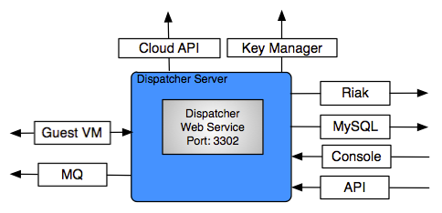

.. _dispatcher:

Dispatcher
==========

The enStratus Dispatcher service is a tomcat service installed to /services/dispatcher.

   Dispatcher Service Connections

Dispatcher Overview
-------------------
The dispatcher service is the heart of the enStratus provisioning operations. It is responsible for executing
user-initiated actions from the enStratus console.

Starting Dispatcher
-------------------
To start the Dispatcher service:

.. code-block:: bash

	/etc/init.d/enstratus-dispatcher start

Dispatcher Start Process
~~~~~~~~~~~~~~~~~~~~~~~~

The dispatcher init script performs two actions:

#. Executes /services/dispatcher/bin/pinger. This starts the pinger service.

#. Passes the start argument to /services/dispatcher/bin/tomcat, which starts the dispatcher service. 

.. code-block:: bash

	Starting pinger.
	Starting Dispatcher.
	Using CATALINA_BASE:   /services/dispatcher/tomcat
	Using CATALINA_HOME:   /services/dispatcher/tomcat
	Using CATALINA_TMPDIR: /services/dispatcher/tomcat/temp
	Using JRE_HOME:       /usr/lib/jvm/java-6-sun

The pinger is an auxiliary service which is responsible for performing a type of heartbeat operation for
virtual machines provisioned in the cloud.

The dispatcher service will start, and a java service will run on port 3302.

.. code-block:: bash

	netstat -tnlup | grep 3302
	tcp6       0      0 :::3302                 :::*                    LISTEN 7199/java  

Stopping Dispatcher
-------------------
To stop the Dispatcher service:

.. code-block:: bash

	/etc/init.d/enstratus-dispatcher stop

	root@ubuntu:/home/greg# stopDispatcher 
	Stopping Dispatcher.
	Using CATALINA_BASE:   /services/dispatcher/tomcat
	Using CATALINA_HOME:   /services/dispatcher/tomcat
	Using CATALINA_TMPDIR: /services/dispatcher/tomcat/temp
	Using JRE_HOME:       /usr/lib/jvm/java-6-sun

Dispatcher Stop Process
~~~~~~~~~~~~~~~~~~~~~~~
The dispatcher init script passes the stop argument to /services/dispatcher/bin/tomcat, which stops the dispatcher
service.

.. note:: The stop argument does not stop the pinger service. This is expected behavior.

Dispatcher Logging
------------------

By default, the dispatcher process logs to: 

.. code-block:: bash

   /services/dispatcher/tomcat/logs/catalina.out

What's in the dispatcher logs? It depends on the logging level being used by the
dispatcher process. The logging level is set in:

.. code-block:: bash

   /services/dispatcher/tomcat/webapps/ROOT/WEB-INF/classes/log4j.xml

#. INFO

   With INFO logging set, very little information will be passed to the log file. 

#. WARN

#. DEBUG

#. TRACE

Dispatcher Troubleshooting
--------------------------

The dispatcher is a very stable process and does not require much attention. However,
here are some areas to consider when managing the dispatcher process.

1. Restarting the Dispatcher

.. note:: Stopping the dispatcher service will cause enStratus to be unusable. 

Here are some helpful commands to stop and start the dispatcher service, as well as
tail the logs. Put these commands in your .bashrc as an alias or a function.

  1. alias startDispatcher='/etc/init.d/enstratus-dispatcher start'

  2. alias stopDispatcher='/etc/init.d/enstratus-dispatcher stop'

  3. alias tailDispatcher='tail -f /services/dispatcher/tomcat/logs/catalina.out'

Once these are set, start the dispatcher process like this:

.. code-block:: bash

  startDispatcher && tailDispatcher

And you'll be able to start and tail the logs in one line. Very helpful. Why is tailing
the log useful?

2. Registering for the first time

3. Entering Cloud Credentials

   It can be helpful to watch the dispatcher logs when entering cloud credentials.

4. Log sizes 

   If the installation is new, it is quite likely that the logging levels are set high

Configuration Files
-------------------

The dispatcher service has 10 configuration files:

.. hlist::
   :columns: 2

   * tomcat
   * enstratus
   * pinger
   * context.xml
   * mq.cfg
   * enstratus-km-client.cfg
   * enstratus-provisioning.cfg
   * dasein-persistence.properties
   * server.xml
   * enstratus-dispatcher

tomcat
~~~~~~

Path:

  /services/dispatcher/bin/tomcat

This file is responsible for controlling the start of the dispatcher service. Any
JAVA_OPTS that need to be passed to the dispatcher tomcat service can be done using this
file.

enstratus
~~~~~~~~~

Path:

  /services/dispatcher/bin/enstratus

This file is responsible setting the user that is used to run the tomcat service, along
with the installation directory of the dispatcher service.

pinger
~~~~~~

Path:

  /services/dispatcher/bin/pinger

The pinger file starts the pinger process associated with the dispatcher service. This is
identical to the pinger process being run with the monitor and worker services. It is
acceptable to run multiple pinger services.

context.xml
~~~~~~~~~~~

Path:

  /services/dispatcher/tomcat/webapps/ROOT/META-INF/context.xml

This file controls how the dispatcher service connects to its associated databases:
provisioning and analytics.

mq.cfg
~~~~~~

Path:

  /services/dispatcher/tomcat/webapps/ROOT/WEB-INF/classes/mq.cfg

This file controls how the dispatcher service connects to the mq service.

enstratus-km-client.cfg
~~~~~~~~~~~~~~~~~~~~~~~

Path:

  /services/dispatcher/tomcat/webapps/ROOT/WEB-INF/classes/enstratus-km-client.cfg

This file controls the connection to the KM service by the dispatcher.

enstratus-provisioning.cfg
~~~~~~~~~~~~~~~~~~~~~~~~~~

Path:

  /services/dispatcher/tomcat/webapps/ROOT/WEB-INF/classes/enstratus-provisioning.cfg

This file is a general control point for several items, the most important of which is the
encryption key for encrypting connections to the KM service.

dasein-persistence.properties
~~~~~~~~~~~~~~~~~~~~~~~~~~~~~

Path:

  /services/dispatcher/tomcat/webapps/ROOT/WEB-INF/classes/dasein-persistence.properties

This file defines the connection to the dasein persistence layer of enStratus. It also
specifies the connection point to the Riak database service.

server.xml
~~~~~~~~~~

Path:

  /services/dispatcher/tomcat/conf/server.xml

The server.xml is responsible for controlling the start of the dispatcher service. This is
the place to change the listening and shutdown port of the dispatcher service.

enstratus-dispatcher
~~~~~~~~~~~~~~~~~~~~

Path:

  /etc/init.d/enstratus-dispatcher

This file is the init script for starting/stopping the enStratus dispatcher service.

Logging Files
-------------

The enStratus dispatcher service logs to /services/dispatcher/tomcat/logs/catalina.out
