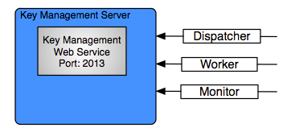

Key Manager
===========

The enStratus Key/Credentials Management service is a tomcat service installed to
/services/km. 

The enStratus KM service is very stable and will run for very long periods of time
without requiring attention.

   KM Service Connections

KM Overview
-----------

The enStratus Key/Credentials management system is responsible for the secure handling of cloud credentials
and any other sensitive information provided via the enStratus console or API. Information is stored in an
encrypted, de-identified database and is not accessible to users.

Starting KM
-----------

To start the Key Management service:

.. code-block:: bash

	/etc/init.d/enstratus-km start

KM Start Process
~~~~~~~~~~~~~~~~

The init script passes the start argument to /services/km/bin/tomcat, which starts the km service.

.. code-block:: bash

	Starting Key Manager.
	Using CATALINA_BASE:   /services/km/tomcat
	Using CATALINA_HOME:   /services/km/tomcat
	Using CATALINA_TMPDIR: /services/km/tomcat/temp
	Using JRE_HOME:       /usr/lib/jvm/java-6-sun

The tomcat service will start, and you should see a java service running on port 2013.

.. code-block:: bash

	netstat -tnlup | grep 2013
	tcp6       0      0 :::2013                 :::*                    LISTEN 7159/java  

Stopping KM
-----------
To stop the Key Management service:

.. code-block:: bash

	/etc/init.d/enstratus-km stop

	Stopping Key Manager.
	Using CATALINA_BASE:   /services/km/tomcat
	Using CATALINA_HOME:   /services/km/tomcat
	Using CATALINA_TMPDIR: /services/km/tomcat/temp
	Using JRE_HOME:       /usr/lib/jvm/java-6-sun

KM Stop Process
~~~~~~~~~~~~~~~
The init script passes the stop argument to /services/km/bin/tomcat, which stops the km service.

Configuration Files
-------------------

The KM service has two configuration files:

#. context.xml
#. server.xml

context.xml
~~~~~~~~~~~

The full path to the context xml configuration file is:

/services/km/tomcat/webapps/ROOT/META-INF/context.xml

This file is responsible for controlling how the KM service connects to the credentials
database.

server.xml
~~~~~~~~~~

The full path to the server.xml configuration file is:

/services/km/tomcat/conf/server.xml

The server.xml is responsible for controlling the start of the KM service itself. This is
the place to change the listening and shutdown port of the KM service.
