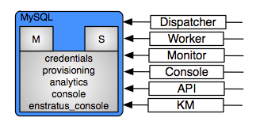

MySQL
=====

   MySQL

Overview
--------

enStratus depends on the MySQL database software. MySQL variants such as percona are also
acceptable. There are 5 total databases associated with the enStratus cloud management
software:

#. credentials
#. provisioning
#. analytics
#. console
#. enstratus_console

A discussion of each database is handled in the services sections. The purpose of this
document is to describe best practices when administering MySQL in support of enStratus.

Installation
------------

The best method for installing MySQL is to leverage the strengths of the Chef or Puppet
configuration management platforms. If you're installing enStratus using packages provided
to you by an enStratus engineer, you're probably using Chef.

Software Requirements
---------------------

Operating system: Any, although enStratus has only been deployed and tested on the Linux
operating system.

Architecture: x86_64

Use the latest MySQL packages provided in your repositories. enStratus recommends MySQL
5.5.

Incoming Connections
--------------------

The MySQL service use to support the enStratus cloud management software should allow for
connections from the km, dispatcher, monitor, worker, console, API, and cwrkr services.
The networking implications of such a requirement depends on the architecture of your
enStratus environment the architecture of MySQL. A summary of the databases and their
dependent enStratus services is shown here:

+-------------------+------------------------------+
| Database          | Service(s)                   |
+===================+==============================+
| credentials       | KM                           |
+-------------------+------------------------------+
| provisioning      | Dispatcher, Worker, Monitor  |
+-------------------+------------------------------+
| analytics         | Dispatcher, Worker, Monitor  |
+-------------------+------------------------------+
| console           | Console, API, Console Worker |
+-------------------+------------------------------+
| enstratus_console | Console, API, Console Worker |
+-------------------+------------------------------+
 
Outgoing Connections
--------------------

None

Configuration
-------------

A default my.cnf file is provided at the time of installation. Additional tuning to MySQL
can be done at the discretion of the database administrators. enStratus MySQL will benefit
from using a dedicated MySQL server. Some recommended tuning to the MySQL engine are shown
here:

.. code-block:: bash

   [mysqld]
   server-id=6
   datadir = /data/MySQL/data/
   tmpdir = /data/MySQL/tmp/
   log_bin = /data/MySQL/logs/MySQL-bin.log
   max_binlog_size = 128M
   bind-address = 0.0.0.0
   max_connections = 1000
   key_buffer = 1G
   max_allowed_packet = 64M
   thread_stack = 128k
   thread_cache_size = 8
   open_files_limit = 4096
   table_cache = 4000
   query_cache_limit = 1M
   query_cache_type = OFF
   query_cache_size = 0
   
   # innodb settings
   innodb_log_file_size = 768M
   innodb_log_buffer_size = 8M
   innodb_flush_method = O_DIRECT
   innodb_file_per_table
   innodb_log_files_in_group = 3
   innodb_log_file_size = 768M
   innodb_buffer_pool_size = 12866M

.. note:: The innodb_buffer_pool_size setting should be set to approximately 80% of the
   available memory on the server hosting MySQL. DO NOT simply copy and paste these
   settings as they are situationally dependent on each environment.

Replication
-----------

In a high-availability environment, setting my MySQL should be deployed in a master-slave
configuration. The method for configuring a master-slave environment is beyond the scope
of this document, but enStratus uses no special tuning parameters in this regard.

Monitoring
----------

Monitoring of MySQL can be done via various methods and can integrate into many enterprise
monitoring systems such as nagios. Production enStratus environments will benefit from
utilizing some nagios plugins to monitor connections, slow queries, slave operation,
master operation, and basic health checks.

Backups
-------

Methods for running backups on an enStratus MySQL system should not differ greatly from
running backups on any other MySQL system. If a master-slave architecture is used and the
slave is having no difficulty keeping up with the master, consider running the backups
against the slave.

The following script will execute a backup for all MySQL databases running on a machine:

.. code-block:: bash

   #!/bin/bash
   
   #
   # Setup configuration values
   #
   HOST=$(hostname)
   USER=dbuser
   PASSWORD=abcdef12345
   DA=$(date +%Y%m%d-%H%M%S)
   MYSQL=/usr/bin/mysql
   MYSQLDUMP=/usr/bin/mysqldump
   GZIP=/bin/gzip
   PGP=/usr/bin/gpg
   
   CONFIG=/etc/mysql/my.cnf
   
   if [ $# -gt 0 ] ; then
     CONFIG=$1
   fi
   
   BASE=$(basename ${CONFIG} .cnf)
   LOGFILE=/var/log/backups-${BASE}.log
   DATABASES=$(${MYSQL} --defaults-file=${CONFIG} -u${USER} -p${PASSWORD} -Bse 'show databases')
   DIR=/backups/db
   
   echo "" >> ${LOGFILE}
   echo "Starting MySQL database backup for ${DA}..." >> ${LOGFILE}
   
   # 
   # Make sure the directory exists
   #
   if [ ! -d ${DIR} ] ; then
       mkdir ${DIR}
       chmod 700 ${DIR}
       chown enstratus ${DIR}
   fi
   
   # 
   # Delete all old files
   #
   find ${DIR} -type f -mtime +2 | xargs rm -f
   
   #
   # Backup each database
   #
   for db in ${DATABASES}
   do
       sleep 10
       NOW=$(date +%Y%m%d-%H%M%S)
       echo -n "        Backing up: ${db} at ${NOW}... " >> ${LOGFILE}
       FILE=${DIR}/${db}-${DA}.sql.gpg.gz
       $MYSQLDUMP --defaults-file=${CONFIG} --single-transaction -u${USER} -p${PASSWORD} $db | $PGP -r enstratusBackup@enstratus.com -e | $GZIP -9 > ${FILE}
       chown enstratus ${FILE}
       chmod 700 ${FILE}
       NOW=$(date +%Y%m%d-%H%M%S)
       echo "Done at ${NOW}." >> ${LOGFILE}
   done
   
   echo "MySQL database backup complete at ${NOW}." >> ${LOGFILE}
   echo "" >> ${LOGFILE}
