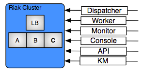

Riak
====

   Riak

Overview
--------

enStratus depends on the Riak database software and will be transitioning to using Riak
exclusively for all of the database needs for the enStratus cloud management software.

A discussion of each database is handled in the services sections. The purpose of this
document is to describe best practices when administering Riak in support of enStratus.

What is Riak? For more information about Riak, please see:

`Riak Overview <http://wiki.basho.com/What-is-Riak%3F.html>`_

Installation
------------

The best method for installing Riak is to leverage the strengths of the Chef or Puppet
configuration management platforms. If you're installing enStratus using packages provided
to you by an enStratus engineer, you're probably using Chef.

Software Requirements
---------------------

Operating system: Any, although enStratus has only been deployed and tested on the Linux
operating system.

Architecture: x86_64

Use the latest Riak packages provided in your repositories. 

Erlang
~~~~~~

Riak depends on erlang, which can also be installed from major package repositories.

HA-Proxy
~~~~~~~~

When deploying Riak in a production environment with 3 nodes, it's best practice to place
the nodes behind a load balancer. enStratus recommends HA-Proxy for ease of deployment and
configuration.

Incoming Connections
--------------------

The Riak service use to support the enStratus cloud management software should allow for
connections from the km, dispatcher, monitor, worker, console, API, and cwrkr services.

.. note:: Depending on the version of enStratus deployed, this may not yet be a hard
   requirement for you, although for planning purposes and upgrade-ability, please consider
   doing this now.

The networking implications of such a requirement depends on the architecture of your
enStratus environment the architecture of Riak. 

Outgoing Connections
--------------------

None

Configuration Files
-------------------

Riak has two primary configuration files:

#. /etc/riak/app.config 
#. /etc/riak/vm.args

/etc/riak/app.config 
~~~~~~~~~~~~~~~~~~~~~

This file is the core configuration file for Riak. It looks funny because it's erlang
code. A text editor with Erlang syntax highlighting would be valuable here.

.. code-block:: erlang
   :emphasize-lines: 39,41,65-67,77,82

  [
      {eleveldb, [
    {data_root, "/var/lib/riak/leveldb"}
      ]},
      {kernel, [
    {inet_dist_listen_max, 7999},
    {inet_dist_listen_min, 6000}
      ]},
      {lager, [
    {crash_log, "/var/log/riak/crash.log"},
    {crash_log_count, 5},
    {crash_log_date, "$D0"},
    {crash_log_msg_size, 65536},
    {crash_log_size, 10485760},
    {error_logger_redirect, true},
    {handlers, [
        {lager_console_backend, info},
        {lager_file_backend, [
      {"/var/log/riak/console.log", info, 10485760, "$D0", 5},
      {"/var/log/riak/error.log", error, 10485760, "$D0", 5}
        ]}
    ]}
      ]},
      {merge_index, [
    {buffer_rollover_size, 1048576},
    {data_root, "/var/lib/riak/merge_index"},
    {data_root_2i, "/var/lib/riak/merge_index_2i"},
    {max_compact_segments, 20}
      ]},
      {riak_control, [
    {admin, true},
    {auth, userlist},
    {enabled, false},
    {userlist, [
        {"user", "pass"}
    ]}
      ]},
      {riak_core, [
    {cluster_name, "prov_production"},
    {handoff_port, 8099},
    {http, [{"127.0.0.1", 8098}, {"10.1.1.45", 8098}]},
    {platform_bin_dir, "/usr/sbin"},
    {platform_data_dir, "/var/lib/riak"},
    {platform_etc_dir, "/etc/riak"},
    {platform_lib_dir, "/usr/lib/riak"},
    {ring_state_dir, "/var/lib/riak/ring"}
      ]},
      {riak_err, [
    {fmt_max_bytes, 65536},
    {term_max_size, 65536}
      ]},
      {riak_kv, [
    {hook_js_vm_count, 2},
    {http_url_encoding, "on"},
    {js_max_vm_mem, 8},
    {js_thread_stack, 16},
    {legacy_keylisting, false},
    {legacy_stats, true},
    {map_js_vm_count, 8},
    {mapred_2i_pipe, true},
    {mapred_name, "mapred"},
    {mapred_queue_dir, "/var/lib/riak/mr_queue"},
    {mapred_system, pipe},
    {multi_backend, [
        {be_default, riak_kv_eleveldb_backend, [
      {data_root, "/var/lib/riak/leveldb"},
      {max_open_files, 50}
        ]},
        {be_blocks, riak_kv_bitcask_backend, [
      {data_root, "/var/lib/riak/bitcask"}
        ]}
    ]},
    {multi_backend_default, be_default},
    {multi_backend_prefix_list, [
        {<<"0b:">>, be_blocks}
    ]},
    {pb_ip, "10.1.1.45"},
    {pb_port, 8087},
    {raw_name, "riak"},
    {reduce_js_vm_count, 6},
    {riak_kv_stat, true},
    {storage_backend, riak_kv_eleveldb_backend},
    {vnode_vclocks, true}
      ]},
      {riak_search, [
    {enabled, false}
      ]},
      {riak_sysmon, [
    {busy_dist_port, true},
    {busy_port, true},
    {gc_ms_limit, 100},
    {heap_word_limit, 40111000},
    {port_limit, 2},
    {process_limit, 30}
      ]},
      {sasl, [
    {errlog_type, error},
    {error_logger_mf_dir, "/var/log/riak/sasl"},
    {error_logger_mf_maxbytes, 10485760},
    {error_logger_mf_maxfiles, 5},
    {sasl_error_logger, false}
      ]}
  ].

.. warning::

  Yes, that period at the end is intentional. This is erlang's line terminator (like `;` in SQL)

The only thing you should NEED to change from the above are the IP addresses. This config
will listen on both localhost and the ip you provide for HTTP connections. The eleveldb
stuff is already setup in this configuration as well. The other settings are highlighted
in case you need to change on-disk locations. A better solution for that, however, is to
simply symlink ``/var/lib/riak`` to where ever the customer wants to store the data before
installing Riak.

/etc/riak/vm.args
~~~~~~~~~~~~~~~~~

This file controls the arguments passed to the Erlang VM at Riak startup (one argument per
line)

It's best just to the example here and replace the appropriate parts:

.. code-block:: bash
   :emphasize-lines: 8

  +A 64
  -setcookie riak
  -env ERL_CRASH_DUMP /var/log/riak/erl_crash.dump
  -env ERL_FULLSWEEP_AFTER 0
  -env ERL_MAX_PORTS 4096
  +W w
  +K true
  -name riak@10.1.1.45
  -smp enable

The only thing you need to change here is the ip address. This should be the non-localhost
IP address of the system that it can communicate with other nodes in the cluster on.

HA-Proxy
--------

An HA deployment of Riak should be load balanced.

Installation
~~~~~~~~~~~~

enStratus talks to Riak over the HTTP port, however enStratus is not aware of the cluster
topology. enStratus only talks to a single IP address. For this reason, you should put
Riak behind an haproxy loadbalancer. This load balancer can live on a separate server OR
it can live on EACH host that needs to talk to Riak. The latter option is actually much
more scalable as it eliminates a single point of failure. The downside is that when you
change the cluster topology. Also each node now has direct access to each Riak server in
the cluster as opposed to only the proxy. It can go both ways.

Regardless of which way you go, the following haproxy config is what we use production:

.. note:: This configuration is for haproxy 1.4. Be sure you are running at least a 1.4 release
  (not 1.3 and not 1.5 which is development). In production we are running 1.4.15 on Ubuntu
  Oneiric from the default repositories.

.. code-block:: bash
   :emphasize-lines: 40,44-46

  global
    log 127.0.0.1   local1 info
    maxconn 100000
    user haproxy
    group haproxy
    #nbproc 2
    #ulimit-n 160000
    stats socket /var/tmp/haproxy_stats level admin user haproxy
    spread-checks 5

  defaults
    log     global
    mode    http
    option  dontlognull
    balance leastconn
    retries 5
    timeout connect 120s
    backlog 10000
    #timeout client 60000
    #timeout server 60000
    timeout queue 30s
    
    option httplog
    option httpchk GET /ping
    option contstats
    option redispatch
    option logasap
    
  frontend riak-fe
    bind *:8098
    mode http
    option httplog
    option contstats
    option redispatch
    option logasap
    default_backend riak-be
    timeout client 120s

  backend riak-be
    balance leastconn
    mode http
    timeout server 120s
    option redispatch
    server provisioning-riak-b 10.1.1.1:8098 weight 1 maxconn 4096 check inter 1m
    server provisioning-riak-c 10.1.1.2:8098 weight 1 maxconn 4096 check inter 1m
    server provisioning-riak-a 10.1.1.3:8098 weight 1 maxconn 4096 check inter 1m

  listen admin 0.0.0.0:22002
    mode http
    stats uri /

The critical lines are highlighted. In haproxy, you define a frontend, a backend and tell
the frontend to use that backend. The other settings are somewhat irrelevant. The `listen
admin 0.0.0.0:22002` also turns on the haproxy status page. This will let you see
important stats about the cluster and provides a good page to scrape for monitoring. It
has a link for exporting the stats as csv so scraping work is minimal.

Monitoring
----------

Monitoring of Riak can be done via various methods and can integrate into many enterprise
monitoring systems such as nagios. 

Backups
-------

The following notes are taken directly from:

`Riak Backups <http://wiki.basho.com/Backups.html>`_

LevelDB Backups
~~~~~~~~~~~~~~~

enStratus leverages LevelDB with Riak.

LevelDB uses a log-structured file format and can be backed up using a variety of methods
to facilitate backups. A copy of the leveldb data directory will be all that is needed to
restore a failed node.

On a standard Linux install of Riak using packages a simple cron job running the following
could be used to create a backup of your Bitcask and ring directories as well as your Riak
configuration:

.. code-block:: bash

   tar -czf /mnt/riak_backups/riak_data_`date +%Y%m%d_%H%M`.tar.gz \
   /var/lib/riak/leveldb /var/lib/riak/ring /etc/riak

Restoring a Node
~~~~~~~~~~~~~~~~

The proper way to restore a node will differ depending on the combination of what you have
named your nodes as well as your environment.

If you are replacing a node with a host that has the same hostname and IP address a
restore is as simple as installing Riak, restoring your configuration files, data
directory, and ring directory. Once this is complete you can start the node.

If your vm.args -name argument is configured to use an IP address, such as -name
riak@10.1.1.10, and you need to replace the host with a host that will have a different IP
address you will need to restore your data directories and config files, make the
appropriate app.config and vm.args changes, and finally execute the riak-admin re-ip
before starting the node.

If you have a robust DNS configuration and use hostnames for your Riak nodes restoring
requires fewer steps. After your update your DNS to take account for the change in IP
check your app.config the HTTP and PB interface bindings. If you bind to all IP interfaces
(0.0.0.0) no changes will need to be made. If not binding to all IP interfaces, you'll
need to update them to use the new interface. Once any needed configuration changes are
made you can restore the data and ring directories and start the node.

Interacting with Riak
---------------------

Interacting with Riak is typically done through the curl utility. 

List Buckets
~~~~~~~~~~~~

Listing all buckets is **not** something that should be done in a production environment
because it places a heavy strain on Riak and is almost never necessary. However, for
troubleshooting and gaining insight into how Riak was installed, issue the command:

.. code-block:: bash

   curl -s http://ipaddress:8088/buckets?buckets=true | python -mjson.tool

   {
    "buckets": [
        "load_balancer",
        "api_key",
        "role",
        "load_balancer_change",
        "content_template",
        "role_assignment",
        "customer",
        "request_page",
        "api_request",
        "cached_load_balancer",
        "frontend_configuration"
    ]
   }

.. note:: The pipe to python -mjson.tool is optional and may be omitted.

To list keys in a bucket do this:

Again, never do this on a live production system. This is the same as ``select * from content_template``

.. code-block:: bash

  curl -s http://ipaddress:8098/buckets/content_template/keys?keys=true | python -mjson.tool

  {
      "keys": [
    "userProfileSelfChangedEmailMessage_en", 
    "newUserEmail", 
    "passwordOtherChangeMessage", 
    "changeAccountData", 
    "changeAccountData_en", 
    "passwordOtherChangeMessage_en_US", 
    "passwordChangeSubject", 
    "passwordOtherChangeMessage_en", 
    "newUserEmail_en_US", 
    "newUserEmail_en", 
    "userProfileSelfChangedEmailMessage", 
    "passwordChangeSubject_en_US", 
    "passwordChangeSubject_en", 
    "changeAccountData_en_US", 
    "userProfileSelfChangedEmailMessage_en_US"
      ]
  }

Riak also has an administrative command line interface, here is an example of a riak-admin
command:

Member Status
~~~~~~~~~~~~~

.. code-block:: bash

   riak-admin member_status

   Attempting to restart script through sudo -u riak
   ================================= Membership ==================================
   Status     Ring    Pending    Node
   -------------------------------------------------------------------------------
   valid      32.8%      --      'riak@10.1.1.16'
   valid      32.8%      --      'riak@10.1.1.208'
   valid      34.4%      --      'riak@10.1.1.45'
   -------------------------------------------------------------------------------
   Valid:3 / Leaving:0 / Exiting:0 / Joining:0 / Down:0 
