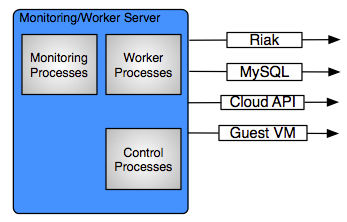

.. _workers:

Workers
=======

   Monitors/Workers Service Connections

Overview
--------

The enStratus worker service consists of two components, a publisher and a subscriber. At a very high level,
these components:

1. Publisher

  - The publisher is responsible for pushing actions onto the enStratus message queue.

2. Subscriber

  - The subscriber is responsible for taking actions off of the queue and acting accordingly.

The enStratus workers service will eventually assume all of the responsibilities of the
enStratus monitor service, which will then be deprecated.

This transition is underway, and the workers already are responsible for handling
several processes that allow the automation and orchestration features of enStratus.

During automated server launches, the enStratus workers service is responsible for
initiating the API call to the cloud provider API for server launch. During standalone
server launches, this activity is handled by the enStratus dispatcher service.

The workers service does not listen for incoming connections.

Installation
------------

Installation of the enStratus worker service is best handled by using a configuration
management system such as Chef or Puppet.

Software Requirements
---------------------

The monitor service depends on the Java 6 Java Development Kit (JDK) provided by Oracle,
along with the associated Java Cryptographic Extensions (JCE). The jsvc is also required.

The JDK is installed to /usr/local/jdk and the jce jars are installed to
/usr/local/jdk/security/lib. JSVC is typically installed to /usr/bin/jsvc or
/usr/sbin/jsvc.

Incoming Connections
--------------------

None.

Outgoing Connections
--------------------

#. Cloud API

   The worker service connects to the cloud provider API to discover changes, track the
   completion of jobs initiated by the dispatcher, and maintain cloud state.

   The worker service also initiates calls to the cloud provider API to launch servers
   during automated server starts.

#. Riak and MySQL

   The worker service connects to the Riak and MySQL databases for the purposes of pushing
   state information. enStratus workers also connect directly to the cloud provider API and
   poll to discover changes. 
   
   The polling interval for each enStratus worker varies depending on the cloud service
   being monitored. Cloud resources that require up-to-the-minute monitoring, for example
   when firewall changes occur, will be polled more rapidly than less critical resources such as
   changes to budget state.

#. Guest VM

   The worker service will also poll guest VM running in the cloud for the purpose of
   collecting logs.

Starting Worker
---------------

To start the worker service:

.. code-block:: bash

	/etc/init.d/enstratus-workers start

Worker Start Process
~~~~~~~~~~~~~~~~~~~~~

The worker init script performs the following actions:

#. Executes /services/worker/bin/publisher, passing it the argument: start. This starts the publisher process.
#. Executes /services/worker/bin/subscriber, passing it the argument: start. This starts the subscriber process.

Stopping Worker
---------------

To stop the worker service:

.. code-block:: bash

	/etc/init.d/enstratus-workers stop

Logging
-------

enStratus worker logging is customer-specific. This makes tracking information about the
state of each worker process very accessible to an administrator. Logs are located in
/services/worker/log.

Monitoring
----------

Backups
-------

Service
~~~~~~~

The enStratus worker service files should be backed up before and after any changes, and
once/day during steady-state operations. Backups should be performed on
/services/worker.

An example of how to backup the worker service is shown here, in this case excluding the
log directory.

.. code-block:: bash

   cd /services/worker/
   tar -czf workerService.tar.gz --exclude='log/*' . > /dev/null 2>&1

Databases
~~~~~~~~~

The enStratus monitor service depends on the provisioning and analytics databases along
with the enStratus dispatcher service. Backups of these database are discussed in the

Configuration Files
-------------------

The enStratus workers service has 9 configuration files

.. hlist::
   :columns: 3

   * dasein-persistence.properties
   * enstratus-km-client.cfg
   * enstratus-provisioning.cfg
   * worker.properties
   * mq.cfg
   * pinger
   * worker
   * publisher
   * subscriber

worker
~~~~~~

Path:

  ``/services/worker/bin/worker``

The worker file controls the start of a new worker process. 

pinger
~~~~~

Path:

  ``/services/worker/bin/pinger``

The pinger file start the pinger process associated with the workers service. This is
identical to the pinger process being run with the dispatcher and monitor services. It is
acceptable to run multiple pinger services.

publisher
~~~~~~~~~

Path:

  ``/services/worker/bin/publisher``

The publisher file controls the enStratus publisher process.

subscriber
~~~~~~~~~~

Path:

  ``/services/worker/bin/subscriber``

The subscriber file controls the enStratus subscriber process.

enstratus-km-client.cfg
~~~~~~~~~~~~~~~~~~~~~~~

Path:

  ``/services/worker/classes/enstratus-km-client.cfg``

This file controls the connection to the KM service by the workers. 

enstratus-provisioning.cfg
~~~~~~~~~~~~~~~~~~~~~~~~~~

Path:

  ``/services/worker/classes/enstratus-provisioning.cfg``

This file is a general control point for several items, the most important of which is the
encryption key for encrypting connections to the KM service. This is also where a setting
called SOURCE_CIDR is made, which specifies IP addresses from which enStratus will make
connections to guest VM.

dasein-persistence.properties
~~~~~~~~~~~~~~~~~~~~~~~~~~~~~

Path:

  ``/services/worker/classes/dasein-persistence.properties``

This file defines the connection to the dasein persistence layer of enStratus. It also
specifies the connection point to the Riak database service.

mq.cfg
~~~~~~

Path:

  ``/services/worker/classes/mq.cfg``

This file controls how the monitor service connects to the mq service.

worker.properties
~~~~~~~~~~~~~~~~~

Path:

  ``/services/worker/classes/worker.properties``

This file is used to define the connection points for the worker processes
to connect to the provisioning and analytics MySQL databases.
