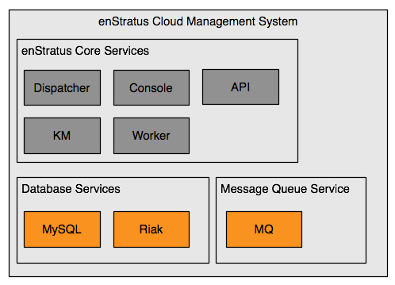

.. _singleNode:

Single Node
-----------

   enStratus Single Node Architecture

In a single node installation, all of the enStratus components shown in the HA
architecture are combined into a single node.
