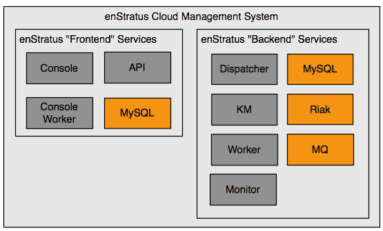

.. _two_node:

Two Node
--------

   enStratus Two Node Architecture

In a two-node installation, enStratus components are grouped into so-called frontend and
backend categories.

**Frontend**

1. Console

  * Console Database (MySQL)
  * enStratus Console Database (MySQL)

2. API
3. Console Worker

**Backend**

1. Dispatcher

  * Provisioning Database (MySQL)
  * Analytics Database (MySQL)

2. Workers
3. Monitors
4. Key Manager

  * Credentials Database (MySQL)

5. Riak
6. Rabbit MQ
