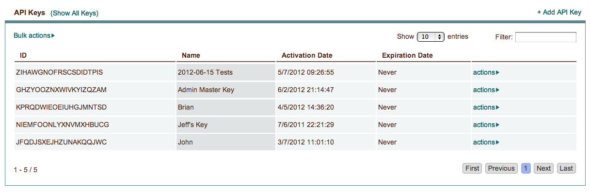
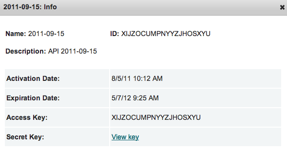

.. _api_keys:

API Keys
--------

|

To see more information about an existing API key, select actions > Info. 

|

For active keys, you can select actions > Expire to set a key to expire immediately.

