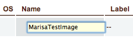
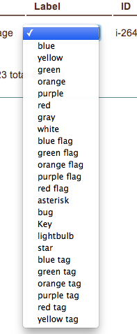
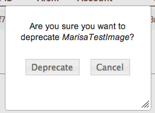
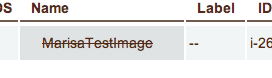
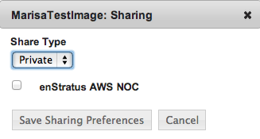

.. _saas_machine_images:

Machine Images
--------------

.. figure:: ./images/machineImages.png
   :width: 1232 px
   :height: 698 px
   :scale: 70 %
   :alt: Machine Images
   :align: center

Overview
~~~~~~~~

A machine image is a saved template of a server. Running servers are started from machine images.

If you are going to be utilizing enStratus images to begin your cloud work, please follow this workflow:

1. Start a server from one of the provided enStratus templates (machine images). 
2. Next, create a machine image from the server you have started.

3. Use the resulting image in your work, not the provided enStratus image.

*Why?*

We update the available enStratus images periodically, and when we do, we delete the old
images to be good stewards of cloud resources. If the backing image of a running server is
deleted, it can lead to imaging problems going forward. It will not affect the running
server.

The functionality included with machine images varies depending on the underlying cloud
provider. Some cloud providers allow access to a public database of images from which
private servers can be started. enStratus allows searching and starting of any publicly
available machine images.

Renaming and Re-labeling
~~~~~~~~~~~~~~~~~~~~~~~~

To rename a machine image, click on the image name. 
The text will become editable.

To change the label color of a machine image, click on the label color and choose the
desired label from the resulting choices.

Machine Image Actions
~~~~~~~~~~~~~~~~~~~~~

.. figure:: ./images/imagesActions.png
   :width: 165 px
   :height: 186 px
   :alt: actions 
   :align: center

Selecting actions from the column in the far right will bring up an interface for manipulating 
that machine image. 

.. note:: Not all options will appear for all images.

Launch
~~~~~~
To start a server from a machine image, select actions > launch.
A dialog box will appear.

.. figure:: ./images/launchGeneral.png
   :width: 882 px
   :height: 686 px
   :scale: 65%
   :alt: actions > launch 
   :align: center

.. note:: Some of the launch parameters are governed by the functionality provided for by the underlying cloud provider. Most cloud providers allow for customization of the amount of hardware (CPU, Memory, storage) provisioned for the server.

**General** 

Security parameters in the form of a firewall can be chosen at the time
of server launch or specified later. (See :doc:`Firewalls <../network/firewalls>` 
for more about using firewalls in enStratus).

enStratus layers additional functionality in the form of groups and budget codes into
server launch for all cloud providers; these are also selected on the General tab.

**Key Pair**

Some cloud providers allow servers to be started with a root keypair. enStratus provides
for this functionality by allowing the user to choose from a set of existing keypairs or
to create a new keypair at launch.

**Volumes**

Additionally, through some cloud providers it is possible to specify a volume group to be
attached, formatted, put into a RAID configuration, and optionally encrypted at launch
time.

**Configuration Management**

.. figure:: ./images/launchConfigMgmt.png
   :width: 875 px
   :height: 652 px
   :scale: 70 %
   :alt: Configuration Management
   :align: center

|

Once the server is launched, it will usually take less than 20 minutes for the server to
be ready for use.

Deprecate
~~~~~~~~~

After confirming the deprecation, the image name will appear crossed out in the image listing (Compute > Machine Images):

Delete
~~~~~~

After a confirmation dialogue, your image will be deleted.

Sharing
~~~~~~~

Sharing images in enStratus is accomplished by selecting the image to
share and selecting action > sharing.

A dialog box with two primary options is presented. The first share type is Private.
Private sharing enables an enStratus user who is a part of several accounts to share
images between those accounts. The accounts of which the user is a part will populate a
dropdown window. Once the image is shared, the image will appear in the other
account.

The second share type is Public. Public sharing enables an enStratus user to add a
image to the publicly available pool of images. This is an option that carries the 
risk of making publicly available private data, so this action should be restricted using
enStratus groups and roles.
