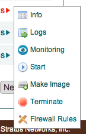
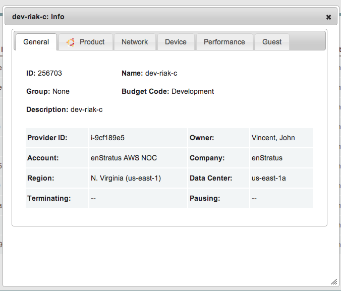
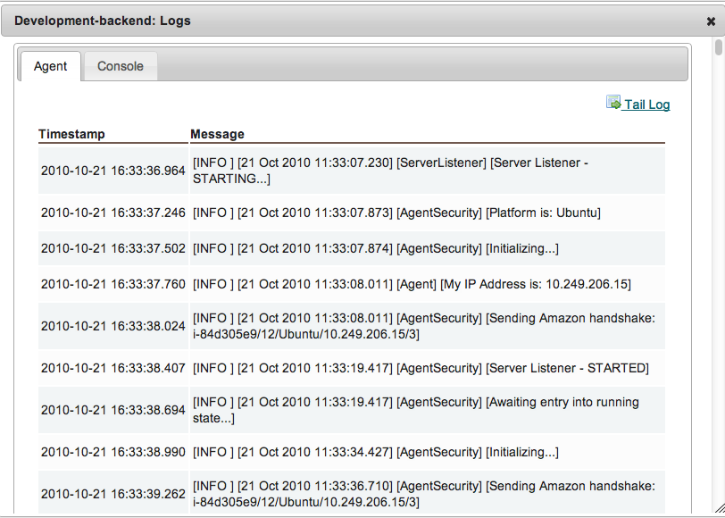
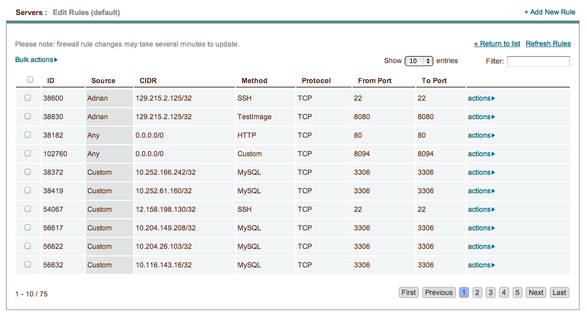

.. _saas_servers:

Servers
-------

enStratus monitors all servers in your account. Select actions from the right-hand column to access
server options. If the enStratus agent is not installed on the server, the options available
are limited to getting information, rebooting, pausing/starting, or terminating the
server. If the enStratus agent is installed on a running server, additional functionality
is included in the actions menu.  

This section describes the options available in the actions menu; options for which the agent
must be installed are indicated with an asterisk(*).

   Actions Menu without Agent, Paused

.. figure:: ./images/actMenuWagent.png
   :alt: Actions Menu without Agent
   :align: center
   :scale: 90 %

   Actions Menu with Agent, Running

Info
~~~~

|

Expanded information regarding server attributes, including agent version (under Guest tab). 

.. note:: The Performance and Guest tabs are only visible with the enStratus agent installed.

Logs
~~~~

|

The Agent tab contains logging information for events such as adding/removing users, 
Host Intrusion Detection System alerts, and customizable information messages. 
The Console tab provides hypervisor information. 

Monitoring
~~~~~~~~~~

Allows you to turn monitoring on or off for the server.

Make Image
~~~~~~~~~~

Making a machine image creates a saved copy of the server state for future use.
Newly made images will appear in Compute > Machine Images.

Machine images should be made whenever changes are
made to the operating system (e.g. patches or updates). 

.. warning:: Running instances must be stopped or rebooted in order to successfully make a new image.

See :ref:`Machine Images <machine_images>` for more information about using machine images effectively.

Make Snapshot*
~~~~~~~~~~~~~~

.. figure:: ./images/actMenuMakeSnap.png
   :alt: Make Snapshot
   :align: center
   :width: 496 px
   :height: 216 px
   :scale: 65 % 

Making a snapshot creates a differential backup of any attached volumes. 
These snapshots can then be used to create new volumes.

See :ref:`Snapshots <snapshots>` for more information about snapshots and their uses.

Shell/Remote Access*
~~~~~~~~~~~~~~~~~~~~

Shell (Linux) and remote (Windows) access refers to creating user accounts on running
servers. Each user in enStratus is assigned a user code of the form p123. When remote
access is granted on a Linux server, a home user account is created on that server and the
public SSH credentials defined in the enStratus user profile are set for the user. On
Windows, a home account is created and the user can access the running server using the
RDP password set in the enStratus profile.

.. note:: Before granting shell/remote access to a server, the user must define their
  public SSH key and/or RDP password in their user profile. If the credentials change, the
  remote servers are not notified of the change. To ensure the new credentials are used, the
  user must first be removed and re-added to remote access so the changes can propagate to
  their account. 

Administrator access can also be set through this option.

Reboot
~~~~~~

Reboot the running server. Rebooting does not change the IP address of the server. 

Pause/Start
~~~~~~~~~~~

Pause or start the running server. enStratus still monitors the server while it is paused. 

.. warning:: The server's IP address will change upon starting after a pause. 

Terminate
~~~~~~~~~

Terminate the instance. No data on the instance will be saved. 

Firewall Rules
~~~~~~~~~~~~~~

Rename
~~~~~~

To rename a running server, click on the server name. 
The text will become editable. The hostname of the server
will be changed.

Label
~~~~~

To change the label of a running server, click on the existing label and choose the
desired new label from the resulting choices.
