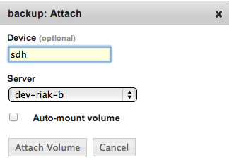

.. _saas_volumes:

Volumes
-------

Overview
~~~~~~~~

Volumes represent block storage. Conceptually, storage devices can be used to store data in a persistent manner in the cloud.

Creating Volumes
~~~~~~~~~~~~~~~~

To create a new volume, navigate to Compute > Volumes. If volumes have been
previously created either within enStratus or via the cloud provider, they will be listed
in the volumes table. Select +Create Volue and the following dialogue appears:

.. figure:: ./images/createVolume.png
   :height: 310 px
   :width: 430 px
   :scale: 75 %
   :alt: Create Volume
   :align: center

|

The name of the volume will be used within enStratus to reference
the volume. The size of the volume is should be between 1 and 1000 gigabytes (1 Tb).

.. note:: The Zone in which a volume is created is important because volumes may only be attached to servers in the same zone. 

Budget Code and User Group can also be added in this dialogue.

Volume creation takes only a few minutes to complete. Once the volume is created it will
be added to the list of volumes. Since newly created volumes are not attached to a server,
the Device and Current Server columns will be blank.

.. figure:: ./images/finishedVolume.png
   :height: 236 px
   :width: 1171 px
   :scale: 70 %
   :alt: Volume Created
   :align: center

   Volume Created

Attaching Volumes
~~~~~~~~~~~~~~~~~

Volumes and servers must share an availability zone for volume attachment to succeed.
Volumes are attached as block storage devices and are neither partitioned nor formatted
when attached. enStratus allows for automated attachment, formatting, and mounting of new
volumes only when starting a new server.

To attach a volume to a server, select actions > Attach.

The only required information to attach a volume is the name of the server
to which the volume will be attached. The list of servers that share an availability zone
will populate the dropdown selector.

Optionally, a device name may be selected for the volume. In this case, I have chosen a
device name of sdh, which means the device will appear as /dev/sdh on the server:

|

.. code-block:: bash

  p335@ApplicationServer:~$ sudo fdisk -l

  Disk /dev/sdh: 2147 MB, 2147483648 bytes 255 heads, 63 sectors/track, 261 cylinders Units
  = cylinders of 16065 * 512 = 8225280 bytes Sector size (logical/physical): 512 bytes / 512
  bytes I/O size (minimum/optimal): 512 bytes / 512 bytes Disk identifier: 0x00000000

  Disk /dev/sdh doesn't contain a valid partition table

|

Once the volume is attached, it can be considered and treated somewhat like an external
hard drive attached to the server. Standard hard drive activities are available including
partitioning, formatting, and mounting.

Detaching Volumes
~~~~~~~~~~~~~~~~~

To detach a volume from a server, select actions > Detach in the far-right column of the volume
you'd like to detach. A dialog box will prompt you to confirm the action.

Creating Snapshots
~~~~~~~~~~~~~~~~~~

Snapshots are created from volumes and volumes are created from snapshots.

A snapshot of a volume represents a differential backup of the data contained on the
volume. This means that only the blocks that have changed are saved each time a snapshot
is created. To create a snapshot, select actions > Make Snapshot for the volume.
The only required information to create the snapshot is a logical
name for the snapshot. 

Once the snapshot is saved, the snapshot will appear at Compute > Snapshots.

See :rel:`Snapshots <snapshots>` for more in-depth information about snapshots and their uses.

Deleting Volumes
~~~~~~~~~~~~~~~~

To delete a volume, select actions > Delete in the far-right column of the volume you'd like to delete.
A dialog box will prompt you to confirm the action and the volume will be removed
from the volumes list.

.. note:: Volume storage is often persistent beyond the life of the server to which it was attached. This makes volumes a very useful item for managing data storage in the cloud. In a high-availability failure-tolerant automated environment, enStratus leverages volumes to restore applications to an operational state without data loss.
