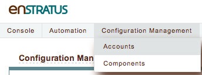
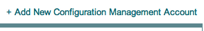
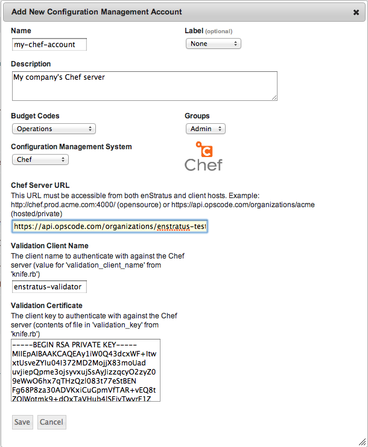

.. _saas_chef_console_account:

Adding to enStratus
~~~~~~~~~~~~~~~~~~~~
Once you've created an account for enStratus to use and have the credentials, you can add that to the enStratus console:

* Navigate to "Configuration Managemet" -> "Accounts"

* Click the link on the right side to "Add A New Configuration Management Account"

* Select "Chef" from the "Configuration Management System" drop-down menu
* Fill in the fields as described.
	Note that speficically to enStratus, the following fields are required:
	* Budget Codes
	* Name
	* Description

* Click "Save"
 
At this point, enStratus will now begin discovery of your ``roles``, ``cookbooks`` and ``environments``.