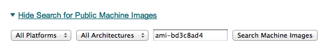
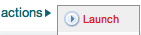
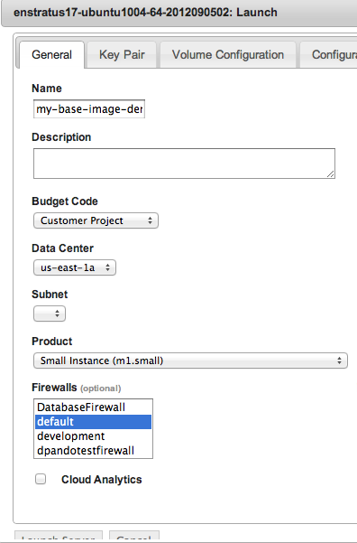
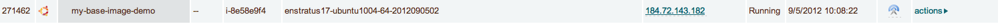
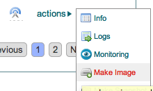
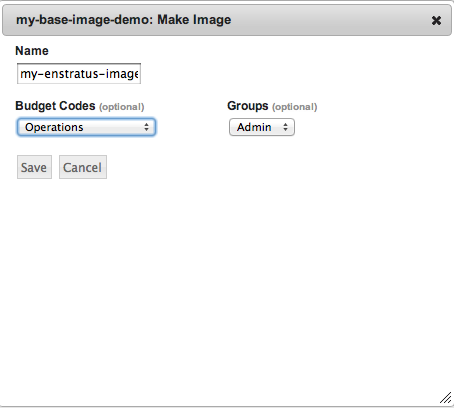

.. _saas_chef_agent:

Prepping an image
-----------------

To be able to launch an instance with Chef (or any CM for that matter), you must meet the
following criteria:

* Your image has v17 of the enStratus agent
* Your image shows as "registered" in the enStratus Console under "Machine Images" (has the enStratus logo)
* Your image has Chef 0.10.x installed (optional)

Depending on your cloud provider and other factors (such as region), enStratus may have
already made an image publicly available with the agent installed.

.. note:: There is an entire guide dedicated to the enStatus agent, however there are a
   few bits of information worth recapping here specifically as it relates to interaction
   with Chef.

Differences from ``knife ec2`` or ``knife bootstrap``
~~~~~~~~~~~~~~~~~~~~~~~~~~~~~~~~~~~~~~~~~~~~~~~~~~~~~

Simply put, enStratus does not use SSH to interact with servers. All communication
(outside of the initial 'phone-home') is driven from enStratus to launched instances via
the enStratus agent.

The enStratus agent is a Java application that is built around a series of extensible
shell scripts. This has its benefits in that what the agent does can be customized by the
user.

In the case of a freshly launched instance, once it has sent its "alive" packet back to
enStratus provisioning, enStratus will, via the agent, run the following script:

``/enstratus/bin/runConfigurationManagement-CHEF``

This script will get information passed to it via the enStratus agent about your Chef
account and any runlist and environment related information. By default, this script will
perform the following actions:

* Look for ``chef-client`` on the path. If not found, the Opscode 'omnibus' installer will
  attempt to run and install Chef

Once Chef is installed (or detected), the script will begin to configure the local Chef
install and initiate an initial run:

#. Look for any existing Chef settings in ``/etc/chef`` and back them up
#. Build a new ``/etc/chef/client.rb``
#. Place the validation PEM (or credentials you provided), into ``/etc/chef``
#. Write the ``first-boot.json`` file
#. run ``sudo chef-client -j/etc/chef/first-boot.json -E <environment> -L /mnt/tmp/enstratus-chefrun.log``
#. After the run, remove the validation pem/credentials from disk

As you can see, enStratus is standing in for the ``knife bootstrap`` process.

.. note:: enStratus does not set up any cron jobs or run ``chef-client`` in daemon mode.
   This is a site-specific setting and should be managed in your Chef cookbooks. enStratus is
   only concerned about the initial bootstrap at this point. enStratus will never initiate a
   client run outside of this initial bootstrap except when used in Deployments.
   
Customizing the bootstrap
~~~~~~~~~~~~~~~~~~~~~~~~~~

You can customize the ``/enstratus/bin/runConfigurationManagement-CHEF`` script as needed.
enStratus ships "opinionated" scripts but you can customize them as you see fit. enStratus
only tests with the shipped scripts.

Making an Image available
~~~~~~~~~~~~~~~~~~~~~~~~~~

All interaction with instances from enStratus is via the agent. Because of
this, enStratus needs guarantees that the image can be trusted to have the Agent
installed.  To this end, there's a process that must be used:

**Launch any public or enStratus public machine image**

enStratus has been making updated images available with v17 of the agent
installed. You are also free to install the agent yourself.

Regardless of which image you launch (public, enStratus or preexisting), the image will be
untrusted. To create a "registered" image, you must image a running server from within
enStratus. Depending on the cloud provider and the type of imaging (i.e. EBS root vs.
instance storage), enStratus will perform the imaging process on any running instance that
it believes has the agent installed. Let's use the following screen shots as a guide:

* Navigate to Compute > Machine Images from the menu and search for public images
  with ``enstratus17`` in the name

The image we'll be using for this document is ``ami-bd3c8ad4`` in AWS US-East and is
called ``enStratus17-Ubuntu1004-64-2012090502``. It is an Ubuntu 10.04 64-bit image. It
also has Chef 0.10 installed from the Opscode "omnibus" installer.

* Launch the image

Click on the "action" menu for the image and select "Launch"

You'll need to fill in the information as appropriate. For now, do NOT set anything in the "Configuration Management" tab. If you plan on customizing the instance at all before imaging, you'll want to launch it with an SSH key-pair configured.

* Customize and make a new image

Once the instance is fully on-line (``Running`` in the server list) 

|

and has detected the Agent is installed (Agent iconography), you can select ``Make Image``
from the instance's "actions" menu: 

* Make note of the name you give the new image:

As this is an instance store instance, the appropriate ``ec2-bundle-*`` and
``ec2-upload-*`` will be run, via the Agent, on the instance. If this were an EBS volume,
the instance would be paused and the root EBS volume snapshotted.

Once the image process is complete, the image will be eventually available under "Compute"
-> "Machine Images" with the enStratus logo visible next to it:

.. note:: enStratus will add any public image you launch to your own list of machine images.

