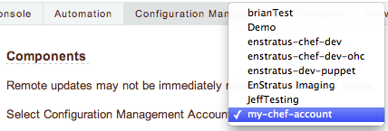
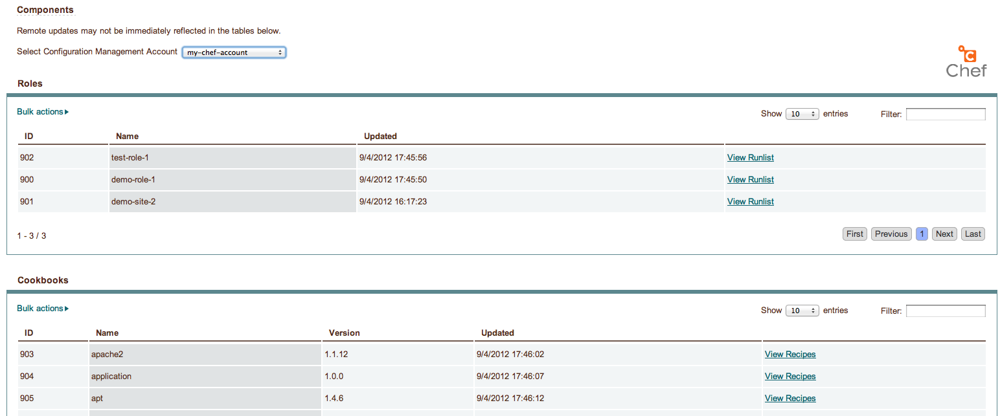

.. _saas_chef_console_discovery:

Checking the status of discovery
--------------------------------

Once you've registered your account with enStratus, a background thread will undertake the
task of enumerating the following information from your Chef server:

* environments
* roles
* cookbooks (and recipes)

Currently there is no visible progress on this action for the user. To check the progress
of discovery, do the following:

* Navigate to "Configuration Management" -> "Components"

.. figure:: ./images/cm-menu-components.png
   :alt: Configuration Management Menu
   :align: center

* Select your Chef server from the drop-down titled "Select Configuration Management Account"

The page will redraw and display a list of any ``roles`` and ``cookbooks`` discovered
along with the date and time of discovery

Asynchronous Discovery
~~~~~~~~~~~~~~~~~~~~~~

.. warning:: Because discovery is asynchronous, you might not immediately see all the data
   you expect to see.  As the page says, changes on the Chef server may not be immediately
   reflected.  Currently there is no way to force a refresh of the discovery process.

Note that the asynchronous nature ONLY affects the ability of enStratus to know what
objects are available for assignment when launching a server.  enStratus does not store
copies of the actual cookbooks. If you make a change to an existing cookbook or recipe
that enStratus has discovered, it is not necessary that enStratus have discovered this
change unless you are adding a new recipe that it has yet to discover.

This will become clearer when you launch a server the first time.

.. tip:: When making frequent changes to your Chef cookbooks, it can be difficult to test those
   especially when creating new roles and they have yet to be discovered by enStratus (and
   thus are not visible in the ``Launch`` dialog for new instances). To work around this
   limitation, you can create a few empty test roles with no run_list in them before
   registering the account with enStratus. Now you can change the run_list of those roles at
   will on the Chef server without enStratus needing to know anything more than they exist.
