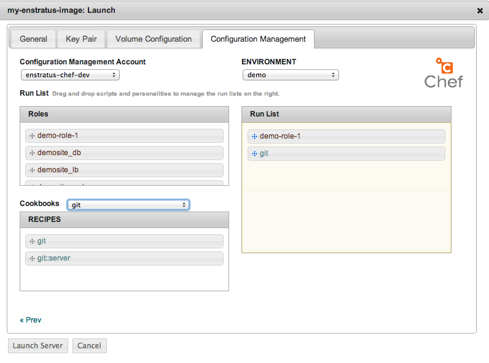
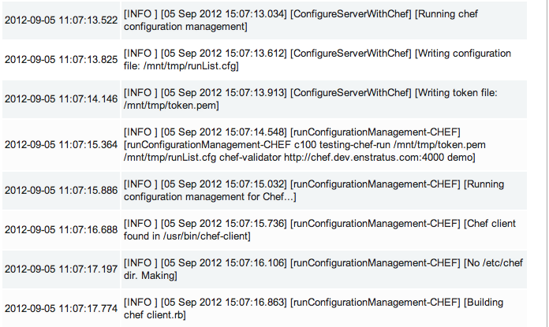
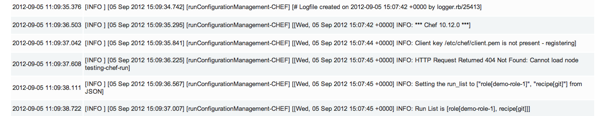

.. _saas_chef_launch:

Launching an instance with Chef
--------------------------------

Now that we have all the prerequisites in place, we're going to launch an instance that
will be handed over to Chef for configuration.

Launching an image
~~~~~~~~~~~~~~~~~~~

From the Machine Images screen, we're going to launch the image that we just registered
with enStratus. The steps are similar to the previous launch except we're now going to set
options on the "Configuration Management" tab.

.. warning:: Please ensure that the image you are launching contains the enStratus logo in
   the list. Configuration Management (and also advanced automation with Deployments) will
   **NOT** work without the enStratus agent installed.

You can set any options you'd like but we're going to focus on the "Configuration
Management" tab here:

You can see from this screen that I'm assigning this server the ``demo`` environment. I've
added a few things to the runlist:

* role "demo-role-1"
* recipe "git"

.. note:: This order is the one passed into the bootstrap process. You can reorder and
   remove as you like.

This process is no different than what you would normally do with ``knife bootstrap``. The
**ONLY** difference is that the bootstrap is being initiated via the enStratus agent
instead of via SSH.

Once you click the "Launch Server" button, enStratus will begin the process of making API
calls to the cloud provider and then waiting for the instance to "phone home".  Once the
server "phones home", enStratus will make a call back to the agent to begin the
configuration process. You can track the progress of this via the "Logs" menu option:

As you can see, we're building the ``client.rb`` and copying some other things around that
were passed down via the agent.

This process will take some time depending on the length of your bootstraps. You can use
the "Tail" option to watch the agent log.  When the Chef client run is complete, it will
send the full log of the run back to the agent. This is very helpful for debugging any
issues in bootstrap:

At this point the instance has launched and you should see it registered with the Chef
server. In our case of the demo role, we're serving a static page populated from an ERB
template.
