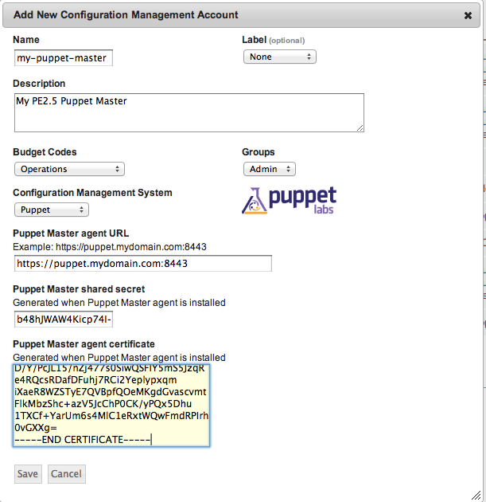

.. _saas_puppet_console_account:

Adding to enStratus
~~~~~~~~~~~~~~~~~~~~
Once you've installed ``espm`` and generated the appropriate credentials, you can add that to the enStratus console:

* Navigate to "Configuration Managemet" -> "Accounts"

.. figure:: ./images/cm-menu.png
   :alt: Configuration Management Menu
   :align: center

* Click the link on the right side to "Add A New Configuration Management Account"

.. figure:: ./images/add-new-cm-account.png
   :alt: Configuration Management Menu
   :align: center

* Select "Puppet" from the "Configuration Management System" drop-down menu
* Fill in the fields as described.
	Note that speficically to enStratus, the following fields are required:
   
	* Budget Codes
	* Name
	* Description

.. note:: The Puppet Master Agent URL field is the ip or hostname and port that you configured ``espm`` to listen on and **NOT** the port Puppet clients communicate to the Puppet master over.

* Click "Save"
 
At this point, enStratus will now begin discovery of your ``groups`` and ``classes``.