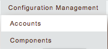
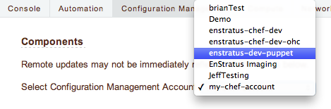
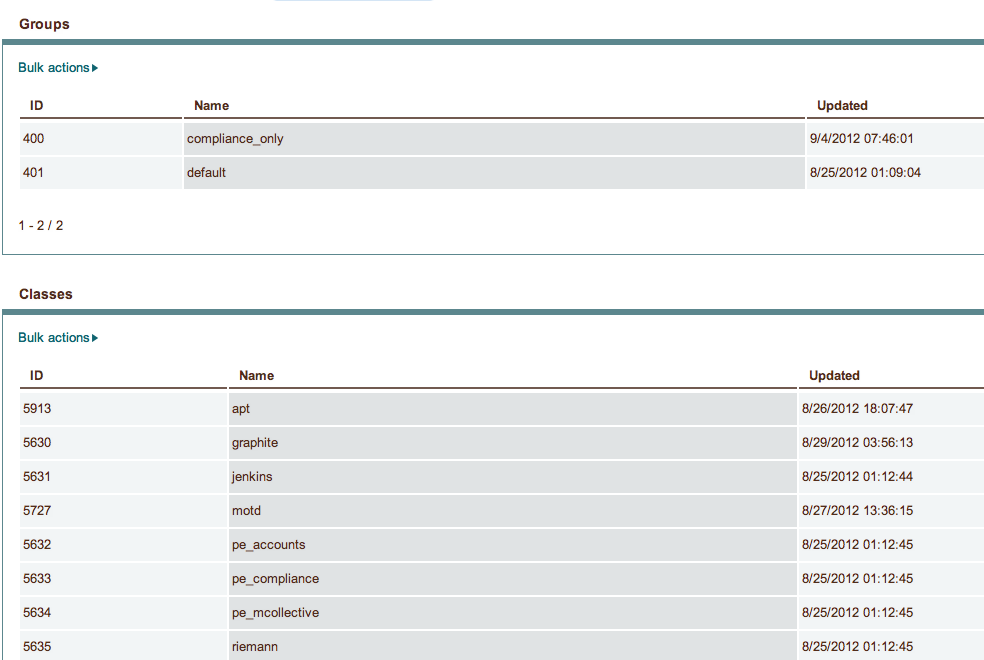

.. _saas_puppet_console_discovery:

Checking the status of discovery
=================================
Once you've registered your account with enStratus, a background thread will undertake the task of enumerating the following information from your Puppet server:

* groups
* classes

Currently there is no visible progress on this action for the user. To check the progress of discovery, do the following:

* Navigate to "Configuration Managemet" -> "Components"

* Select your Puppet server from the drop-down titled "Select Configuration Management Account"

The page will redraw and display a list of any ``groups`` and ``classes`` discovered along with the date and time of discovery

A word on asynchrous discovery
~~~~~~~~~~~~~~~~~~~~~~~~~~~~~~~

.. warning::
   Because discovery is asynchronous, you might not see all the data you expect to see.
   As the page says, changes on the Puppet server may not be immediately reflected.
   Currently there is no way to force a refresh of the discovery process.

Note that the asynchronous nature ONLY affects the ability of enStratus to know what objects are available for assignment when launching a server.
enStratus does not store copies of the actual modules. If you make a change to an existing module that enStratus has discovered, it is not neccessary that
enStratus have discovered this change unless you are adding a new module that it has yet to discover.

This will become clearer when you launch a server the first time.

.. tip::
   When making frequent changes to your modules, it can be difficult to test those especially when creating new groups and they have yet to be discovered by enStratus (and thus are not visible in the ``Launch`` dialog for new instances). To work around this limitation, you can create a few empty test groups with no classes or parameters in them before registering the account with enStratus. Now you can change the contents of those groups at will on the dashboard without enStratus needing to know anything more than they exist.