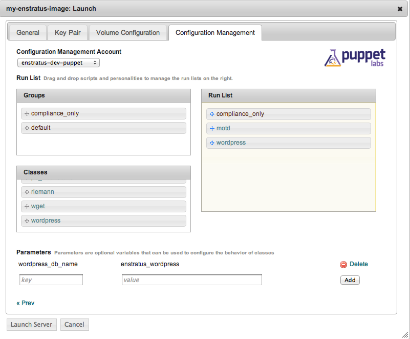
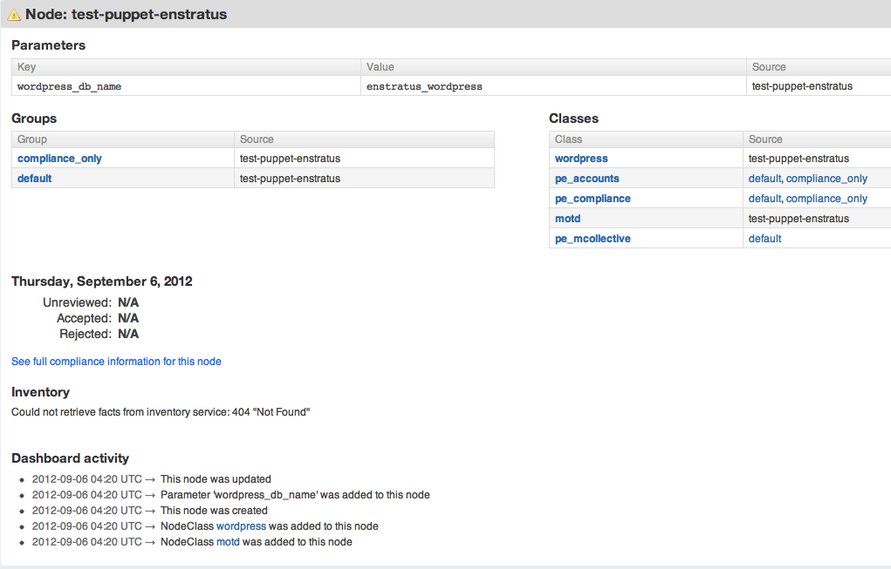
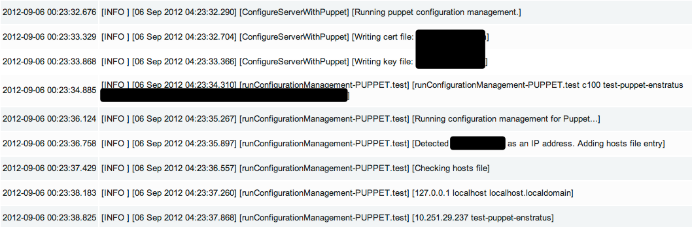
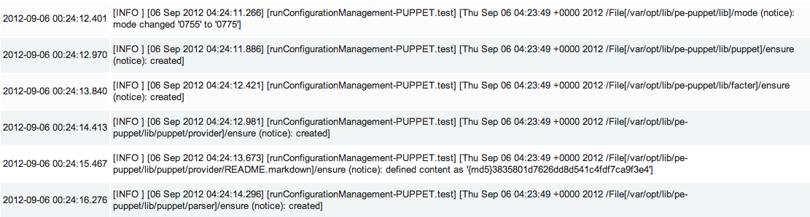
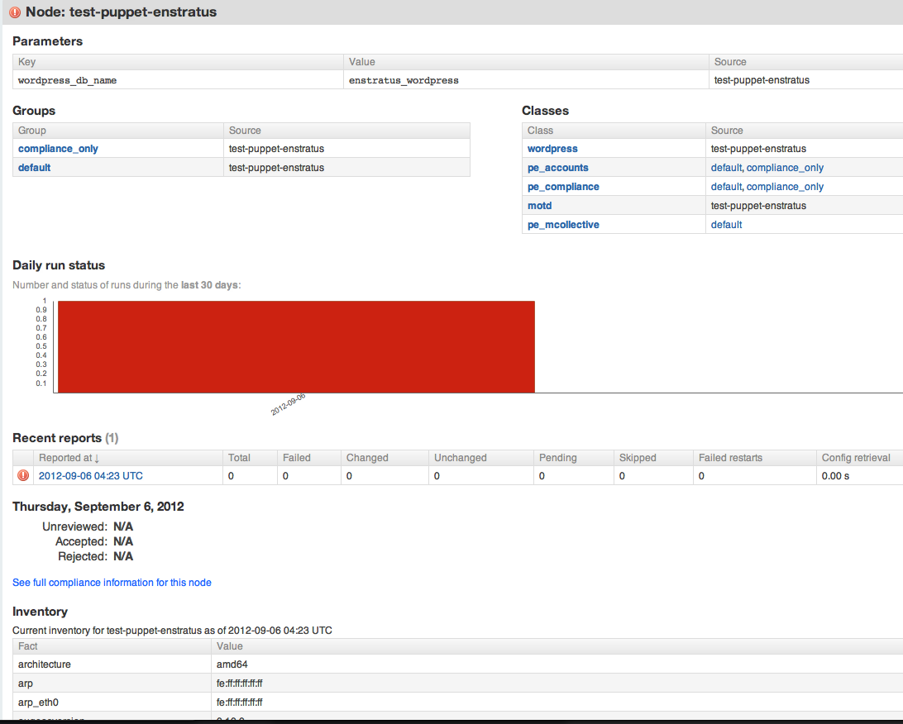

.. _saas_puppet_launch:

Launching an instance with Puppet
==================================
Now that we have all the prerequisites in place, we're going to launch an instance that will be handed over to Puppet for configuration.

Launching an image
~~~~~~~~~~~~~~~~~~~
From the Machine Images screen, we're going to launch the image that we just registered with enStratus. The steps are similar to the previous launch except that now options are going to be set on the "Configuration Management" tab.

.. warning:: Please ensure that the image you are launching contains the enStratus logo in the list. Configuration Management (and also advanced automation with Deployments) will **NOT** work without the enStratus agent installed.

You can set any options you'd like but we're going to focus on the "Configuration Management" tab here:

You can see from this screen that the server has been assigned the group (``compliance_only``) and a few things have been added to the run list:

* the classes ``motd`` and ``wordpress``
* some parameters to be used for the wordpress module

This process is no different than what you would normally do with PE 2.5 console. The **ONLY** difference is that the initial agent run is being initiated via the enStratus agent instead of via SSH.

Once you click the "Launch Server" button, enStratus will do the following:

* contact the ``espm`` agent and attempt to create the node based on the name you gave it
* assign the groups, classes and parameters you've selected
* generate and sign the client certificates

Once this is complete, enStratus will begin the process of making API calls to the cloud provider and then waiting for the instance to "phone home".
Once the server "phones home", enStratus will make a call back to the agent to begin the configuration process. 

.. tip:: If enStratus gets a conflict on creation of the node, due to its name it will take the existing name you specified and append a millisecond timestamp to the name. It will then attempt the registration process again.

If you switch over to your PE2.5 console, you can see that the node was already registered and Puppet is waiting for it to check in:

You can track the progress of this via the "Logs" menu option:

As you can see, enStratus is populating the hosts file and copying some other things around that were passed down via the agent.

This process will take some time depending on the length of your bootstraps. You can use the "Tail" option to watch the agent log.
When the Puppet run is complete, it will send the full log of the run back to the agent. This is very helpful for debugging any issues in bootstrap:

At this point your instance has launched and should be working as defined by your Puppet modules (assuming those work). You can see from the report in the PE2.5 Console that there is some work to do with these modules.

