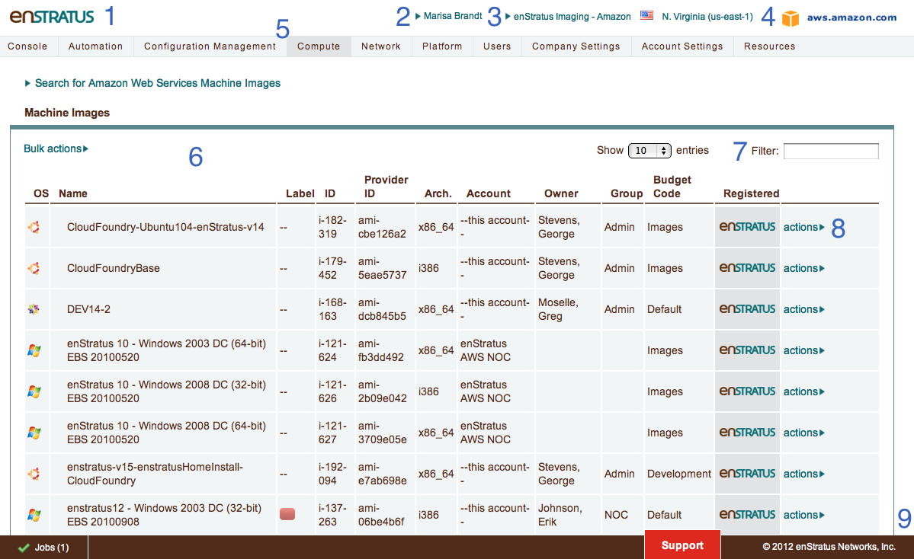
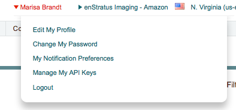
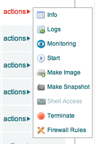
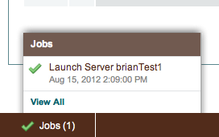

.. _console_overview:

Console Overview
----------------

This section covers the individual components of the enStratus console at a high level:

.. not sure this caption adds much, so commenting it out   UI Overview

.. code-block:: none
.. commenting out this table b/c it's not needed with the new layout
..  +-------+--------------------------+
..  | Field | Meaning                  |
..  +-------+--------------------------+
..  | 1     | Customer Brand           |
..  | 2     | User/Profile             |
..  | 3     | Account                  |
..  | 4     | Region                   |
..  | 5     | Cloud                    |
..  | 6     | Navigation Menu          |
..  | 7     | Content Pane             |
..  | 8     | Filter                   |
..  | 9     | Action Menu              |
..  | 10    | Staus/Alert/Support Menu |
..  +----------------------------------+

1. Custom Logo
~~~~~~~~~~~~~~
This logo can be customized for your enStratus installation.

2. User Profile
~~~~~~~~~~~~~~~

.. (it turns out that I don't like captions, at least when they repeat the subject heading)   User Profile

Clicking on the name of the person logged in to the enStratus console
provides functionality for editing user profile information (:doc:`including setting notification targets <notifications>`),
password changes, notification preferences [LINK HERE TOO - this isn't currently a page, but should be on its own soon], and API key management.

3. Account & Region
~~~~~~~~~~~~~~~~~~~

.. figure:: ./images/multipleAccounts.png
   :height: 187 px
   :width: 373 px
   :scale: 100 %
   :alt: Account
   :align: center

..   Account

enStratus can access many accounts in one cloud provider or accounts in separate clouds
simultaneously. Clicking on the account will activate a drop-down menu for selecting an account. 

If the underlying cloud provider has the concept of regions, those regions will be
displayed and be selectable from here as well. When you enter your cloud credentials for the first time, these
regions will auto-populate as enStratus begins to discover the attributes of the cloud
provider.

4. Cloud
~~~~~~~~

Logo of the current cloud provider. When navigating between different cloud providers, this logo
will change to reflect the selected cloud.

5. Navigation Menu
~~~~~~~~~~~~~~~~~~
The navigation bar displays the first level of interaction with an account's resources, services, and settings.
Available top-level menu items will be limited by the logged-in user's role. 

6. Content Pane
~~~~~~~~~~~~~~~
The main content window for interacting with cloud resources is the content pane. The
content displayed in this main window depends on the selections made in the
navigation menu. For example, if Infrastructure > Servers is selected, all
active servers will be displayed in the content pane.

7. Filter
~~~~~~~~~
The filter text box allows for dynamic filtering of content presented in the content pane.

8. Actions Menu
~~~~~~~~~~~~~~~

The actions menu is activated by clicking on one of the "actions" links to the right of a resource.
Options in this menu depend on the selected resource.

The action menu shown here is for a cloud server. Note: Some options shown in this
image are only available after the enStratus agent has been installed on the virtual
machine.

If the cloud administrator for your account has implemented groups and roles, the action
link may or may not be present. Presenting or hiding this link
is one method enStratus uses to enforce role-based access controls for cloud
infrastructure.

9. Notification/Alert/Support Menu
~~~~~~~~~~~~~~~~~~~~~~~~~~~~~~~~~~

The status menu is located at the bottom of the content pane. If there are any notifications or alerts in
any of the accounts of which you are a part, they will be displayed here. Alerts are
categorized as High, Medium, or Low. Clicking on an alert color will slide out a truncated
list of alerts. Options for interacting with notifications and alerts include clicking on them to view in more detail or
deleting them.

The support link provided at the bottom of the console provides an integration point for
external help desk functionality, such as Zendesk. In the SaaS offering for enStratus,
clicking the support link will activate a dialog window for sending a support request to
the enStratus team.
