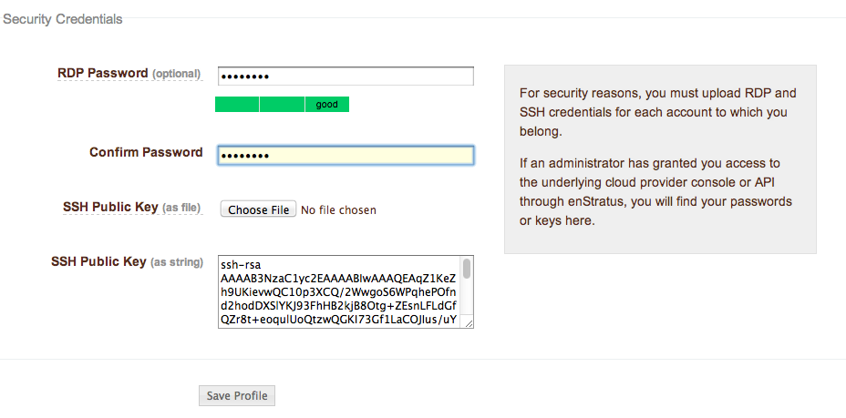

.. _edit_profile:

Edit Profile
------------

.. figure:: ./images/updateduserprofile.png
   :height: 185 px
   :width: 394 px
   :scale: 100 %
   :alt: User Profile
   :align: center

In enStratus, user profiles contain both basic information and a user's security
credentials.

.. figure:: ./images/userProfileGeneral.png
   :width: 909 px
   :height: 402 px
   :scale: 80 %
   :alt: General Profile Information
   :align: center

   General Profile Information

|

In addition to changing profile information, users can add an SMS number for 
multi-factor authentication, if enabled.

   Profile Security Credentials

Users can also add RDP password and SSH key details from within their profiles. 

Once the credentials have been entered and the profile is saved, the user can then access
remote servers as outlined in the Compute > Servers section through Shell/Remote
access provided they have the appropriate access rights to take this action.

:doc:`including setting notification targets <notification_targets>`

[add link to appropriate doc using the above syntax...]
