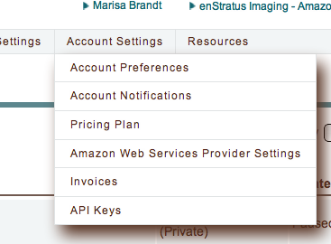
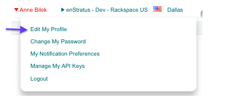

.. _notification_targets:

Setting Notification Targets
----------------------------

Setting Notification Targets for Accounts
~~~~~~~~~~~~~~~~~~~~~~~~~~~~~~~~~~~~~~~~~

To set account-wide notification preferences, select Account Settings > Account Notifications.
You must be an account administrator to use this feature.

|

|

Notification targets are endpoints to which notifications and alerts can be sent. You can specify the following endpoints:

|

.. figure:: ./images/notifications_1.png
   :alt: Alerts and Notifications targets
   :align: center
   :scale: 90 %
   :height: 341 px
   :width: 603 px

|

The API target allows you to specify an API endpoint for notifications.
For Email and SMS notification targets specify an email address or mobile number (including country code) to send notifications.

The Notification Topic Target allows you to leverage notification services such as Amazon SNS (`<http://aws.amazon.com/sns/>`_). Topics can be set up and configured at Platform > Notification Topics.

Setting Notification Targets for Users
~~~~~~~~~~~~~~~~~~~~~~~~~~~~~~~~~~~~~~

Users may set personal targets for notifications across all their accounts by editing their profile in their header menu.

|

