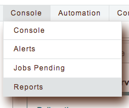
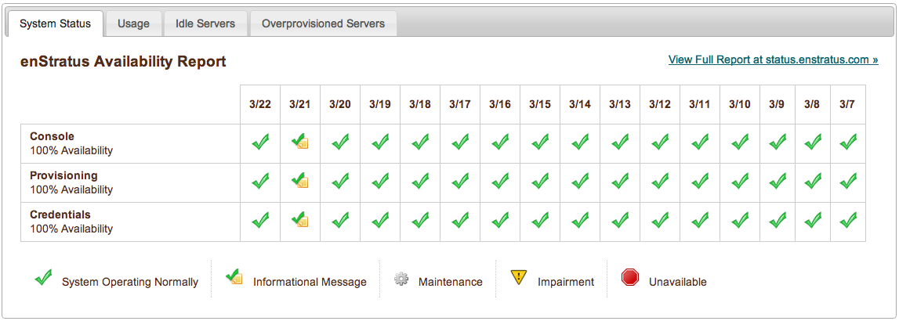
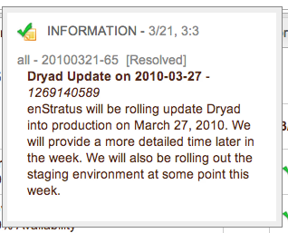
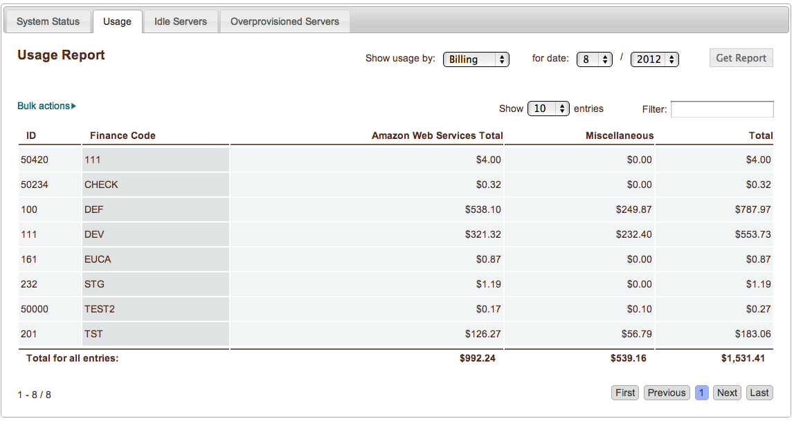
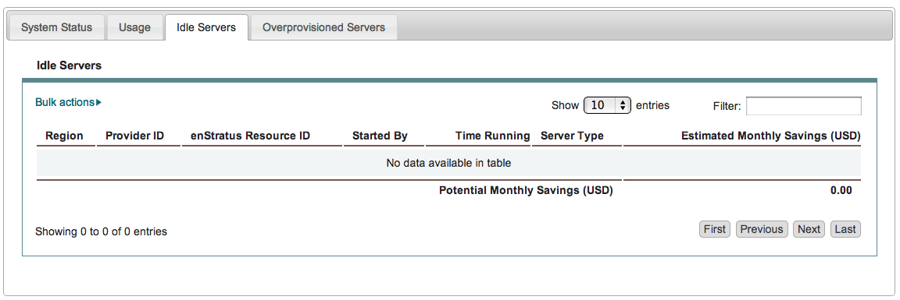
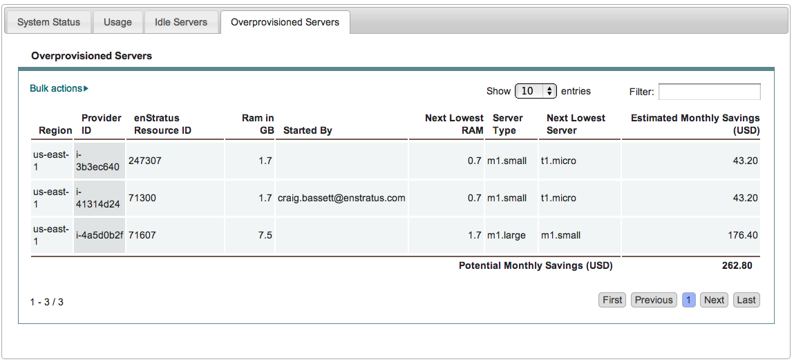

.. _reports:

Reports 
--------

|

To view reports, select Console > Reports. This selection will open a pane with four tabs.
In the first tab, enStratus displays an Availability Report:

|

If there is a message associated with a system status, you can view it by moving your cursor
over the message:

|

In the Usage tab, usage information can be sorted by budget code, resource, group, or user; 
a date range must also be specified (the dafault is for current month and year). Click
Get Report to generate a new report:

|

Idle servers can be a drain on company resources; the Idle Servers report will help
identify such servers (if any):

|

Likewise, identifying overprovisioned servers can provide a cost savings:

