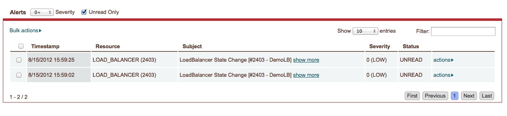

.. _user_notifications:

Setting User Alert and Notification Preferences
-----------------------------------------------

Users can set their notification and alert preferences by selecting My Notification Preferences from their header menu.

.. figure:: ./images/notifications_6.png
   :alt: User Preferences
   :align: center

.. note:: Users have an additional “Screen” delivery mechanism for both their alerts and notifications. The endpoint for Screen notifications is the enStratus console - that is to say, alerts and notifications with the Screen preference ticked will be delivered to the footer of the enStratus console and the Console > Alerts page. See Screen Notifications below for more information.

In the following example, any event on any resource (ANY.ANY) will trigger a Screen notification. FIREWALL.CREATE will trigger an Email notification, SERVER.CREATE will trigger a Topic notification, and FIREWALL.UPDATE, FIREWALL.DELETE, and SERVER.DELETE will trigger SMS notifications.

.. figure:: ./images/notifications_7.png
   :alt: User Preferences
   :align: center

|

Screen Notifications
~~~~~~~~~~~~~~~~~~~~

Users will see Screen notifications in two places in the enStratus console: in the lower left-hand footer on every page, and at Console > Alerts.

.. figure:: ./images/notifications_8.png
   :alt: Screen Notifications
   :align: center

|

Click on the footer notifications menu for a quick view of notifications. To delete a notification, mouse over it in the menu and click the X. 
If you want to clear all notifications quickly, click the Clear All Alerts link. You will be prompted to confirm you want to clear notifications of all severity across all your accounts.

For more detail on your notifications, click the View All link in the notification menu. This will bring you to the Console > Alerts page.

On this page you can mark alerts read and delete them individually or in bulk. If you click the “show more” link  to the right of an individual subject,
you will see more detail about the notification or alert.
