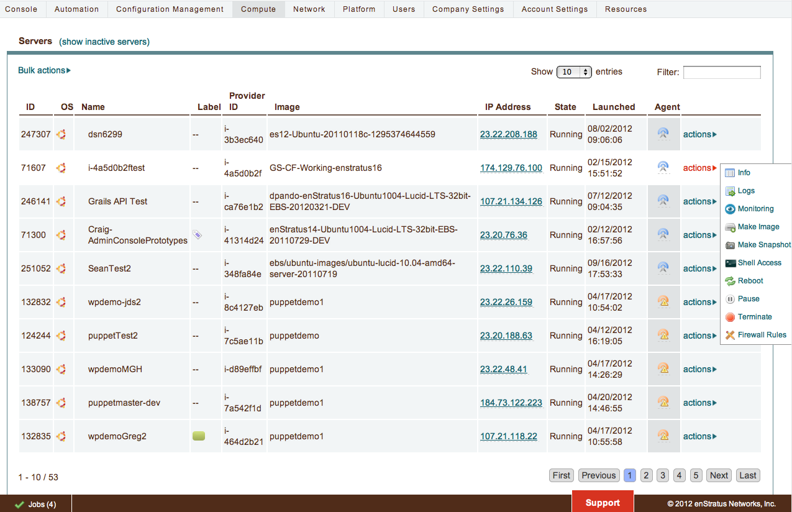

.. enStratus documentation master file, created by
   sphinx-quickstart on Mon Mar 12 21:46:44 2012.
   You can adapt this file completely to your liking, but it should at least
   contain the root `toctree` directive.

Welcome to the enStratus Software-as-a-Service (SaaS) documentation portal. Use the menu at left to learn more 
about using our SaaS product.

|

.. toctree::
   :maxdepth: 4
   :hidden:
    
   console/console
   configuration_management/configuration_management
   automation/automation
   compute/compute
   network/network
   platform/platform
   users/users
   budget/budget
   agent/agent
   api/api
   acct_settings/acct_settings
