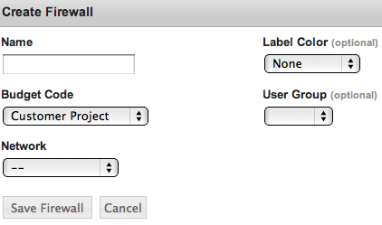
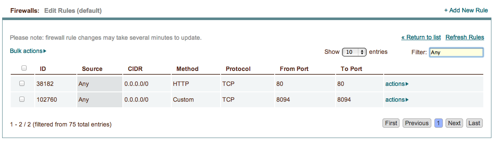
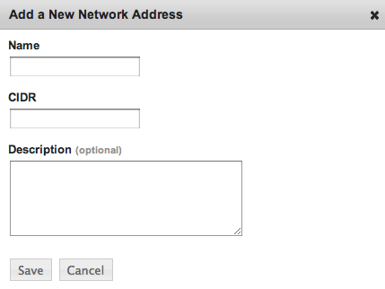
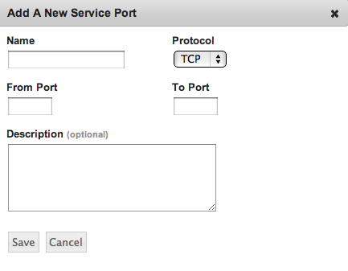

.. _saas_firewalls:

Firewalls
---------

.. figure:: ./images/firewalls.png
   :width: 1162 px
   :height: 526 px
   :scale: 65 %
   :alt: Firewalls
   :align: center

Firewalls in enStratus control access to running servers. Each
account has a firewall called 'default' that is the default firewall into which all
servers are launched. This default configuration includes rules that allow the enStratus monitoring service to 
connect to running servers.

.. note:: Some cloud providers use the term "security group" to describe this kind of firewall.

Generally, the process for managing firewalls is to first create the firewall and
then choose a firewall for new servers to use at launch.

To access firewalls in the enStratus console, navigate to Network > Firewalls. A
listing of the active firewalls will be shown. To add a new firewall, click on
+Create Firewall. Only two pieces of information are required to create a firewall: 
Name and Budget Code; Network, Label Color, and User Group are all optional fields.

Once the firewall has been saved, it will be added to the list of active firewalls. As soon as
the firewall is active, it will be provided as an option when launching new servers.

Editing Firewalls
~~~~~~~~~~~~~~~~~

To edit an existing firewall, select actions > Edit Rules for the 
firewall targeted for editing. A new pane will appear showing the rules that comprise
the firewall. From this screen, existing rules can be deleted and new rules can be added.

The columns that make up the firewall are:

**ID**

**Source** - A common name for the firewall rule. Standard networks naming conventions apply
to this column. If a previously defined network address is used, the CIDR column will be automatically
populated with the information defined by that network address.

**CIDR** - CIDR means Classless Inter-Domain Routing. Practically, this means / or "slash"
notation is required. For example, to apply a rule to only one IP address, the rule takes
the form: 1.2.3.4/32. This is practical for creating a rule for your home IP address. This
type of notation allows for firewall rules that encompass ranges of IP addresses. For
example, to apply a rule to a range of 256 IP addresses, this represents a rule of the
form: 1.2.3.0/24. This is a very powerful feature of firewall rule creation.

**Method** - Refers to the program being used, and provides a common name for the program (e.g.
MySQL or SSH). Service ports can be used to modify this part of the ruleset.

.. note:: Protocol, From Port and To Port are automatically populated with the information provided by the selected service port.

**Protocol** - Indicates the type of protocol that will apply, TCP, UDP, or ICMP.

**From Port** - The starting port for the rule.

**To Port** - The ending port for the rule.

Adding New Firewall Rules
~~~~~~~~~~~~~~~~~~~~~~~~~

To add a new rule to an existing firewall, go to actions > Edit Rules for the firewall. Select +Add New Rule from the upper right.
The following dialogue will appear:

.. figure:: ./images/firewallsAddrule.png
   :width: 594 px
   :height: 331 px
   :scale: 65 %
   :alt: Add New Firewall Rule
   :align: center

.. note:: The Source drop-down is populated from Company Settings > Network Addresses. Likewise, the Method drop-down is populated from Company Settings > Service Ports. See next section for details. 

Network Addresses
~~~~~~~~~~~~~~~~~

In enStratus, a Network Address is a user-defined, commonly used network that can be quickly added to a firewall using a
common name that maps to the IP address specified. This functionality 
makes it easy to identify, add, and remove specific firewall rules among
what may be a long list of rules.

For example, if a user typically connects from a particular office IP address, this
address can be added as a network address and named appropriately for ease of
identification.

Similarly, service ports are user-defined, commonly used ports that typically map to a
specific application. For example, if an application is required to allow connections on
port 5555, a service port can be defined to identify that application by a common name
and add it to the firewall.

To define a new network address, navigate to Company Settings > Network Address. Select +Add New Network Address 
from the upper right and  
complete the resulting dialog box.

Once the network address is saved, it will be added to the list of selectable networks.

To define a Service Port, navigate to
Company Settings > Service Ports. To add a new Service Port, select
+Add A New Service Port and complete the resulting dialog box.

Once the Service Port is saved, it will be added to the list of available service ports.

.. note:: If a Network Address or Service Port is deleted, the rule will still be applied to the
  firewalls, but it will lose its customized name and revert to a Custom
  rule.

Starting a Server in a Firewall
~~~~~~~~~~~~~~~~~~~~~~~~~~~~~~~

The final step in utilizing firewalls in the cloud is to apply a firewall when
starting a new server. To start a new server, navigate to Compute > Machine Images.
Select an image to launch and in the resulting dialog box, choose the firewall to be
applied to the resulting server. All of the rules comprising the firewall will be
applied to the server.

See :ref:`Machine Images <saas_machine_images>` 
for more about starting images in enStratus).

