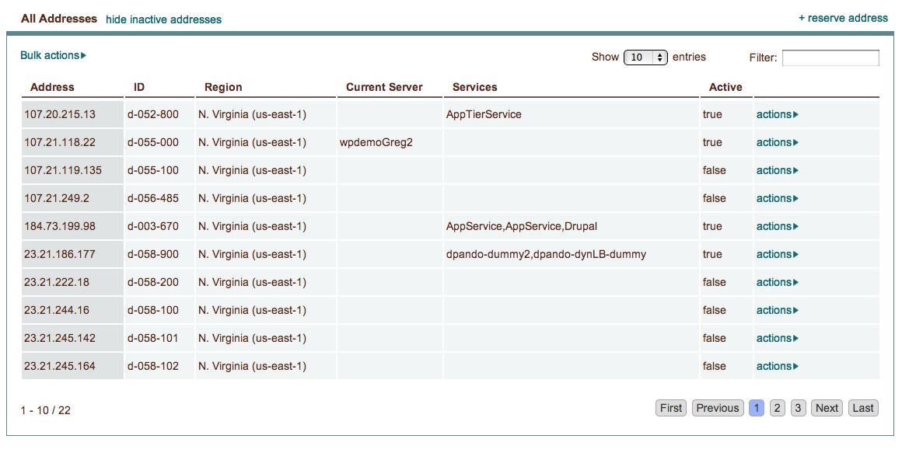

.. _saas_ipaddresses:

IP Addresses
------------

Overview
~~~~~~~~

*IP Addresses allow for reservation of static ip addresses which can then be assigned to running servers.*

.. note:: IP address reservation is a feature not available in all clouds. If it's not a
  feature supported by your cloud provider, enStratus will not present it in the console.

To reserve an IP Address, click on +reserve address in the upper right and select Reserve
IP Address. A new IP address will be added to the list of Active Addresses.

.. note:: In the Amazon cloud, there is a limit of 5 reserved IP addresses. To reserve
  more, you must contact Amazon Web Services.

Once the IP address has been reserved it is available for use by assigning it to a running
server. To assign the IP address to a server, select actions > assign.
A dialog box will appear with a dropdown list of available servers. Select your
server from the list and choose Assign address. It will take a few moments for the
assignment to be made.

If an addresses is already assigned to a server and you would like to de-assign it,
select actions > release. This action will also take a few moments.

.. warning:: Unused reserved IP addresses still cost money even though they are not assigned to a running server. 

To delete an IP address, click on the actions button and choose delete.
Confirm the deletion in the resulting dialog box and the IP address will be removed from
your account.
