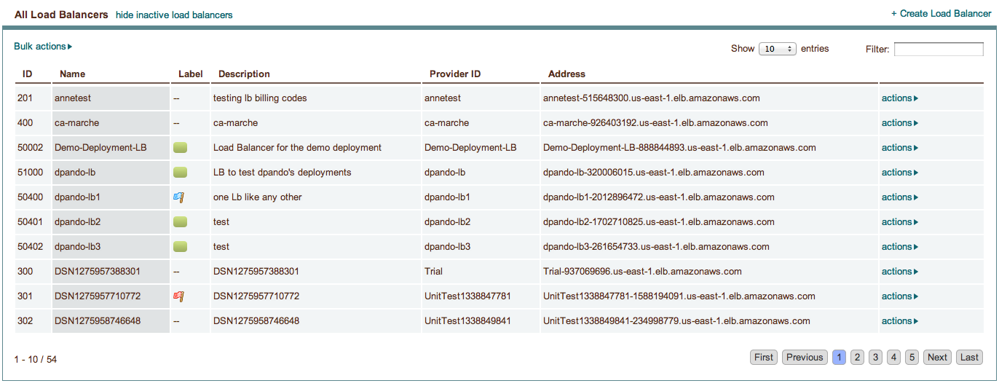
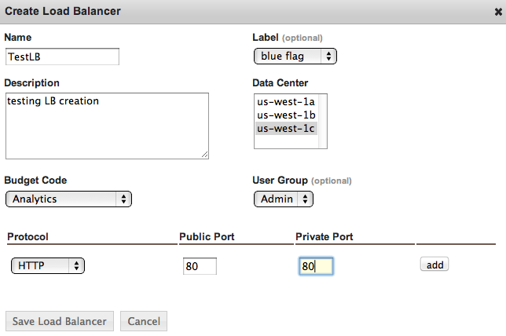
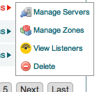
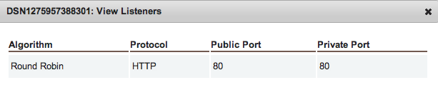

.. _saas_load_balancers:

Load Balancers
--------------

Successful application load balancing involves dynamically adding and removing application
nodes from the load balanced pool. This discussion is limited to addressing the activity
that takes place on the load balancer.

Overview
~~~~~~~~

enStratus supports a wide range of load balancers. In the Amazon Cloud, Elastic Load
Balancers are available for provisioning and use from within enStratus. Server-based load
balancers can be started for use or an existing server can be purposed as a load balancer
via HA-Proxy or ajp (mod_jk). Finally, third party load balancing solutions are available
in the form of the Zeus load balancer.

Elastic Load Balancer
~~~~~~~~~~~~~~~~~~~~~

Elastic load balancers (ELB) are an offering from Amazon Web Services that are well supported in
enStratus. ELB are advantagous because they can be cheaper to operate than server based
solutions. Additionally, the configuration requirements for ELB are often simpler than using server-based
load balancing.

To provision a new elastic load balancer using enStratus, navigate to Network > Load
Balancers. Select +Create Load Balancer. A single dialog box will present the 
configuration options for the load balancer.

ELB Discussion
~~~~~~~~~~~~~~

The Name, Label, and Description fields should be self-explanatory. More care should be
taken when configuring the Data Center portion of the dialog. Each selected data center
will receive an equal portion of the traffic entering the load balancer. This means that
for each data center configured, there should be a "listening" application server to field
the load balanced traffic.

For example, let's assume we have a load balancer configured for data centers us-east-1a
and us-east-1b. This means that 50% of the inbound traffic that reaches the load balancer
will be sent to associated servers in east-1a and 50% of the inbound traffic will be sent
to servers in east-1b. If no servers are provisioned in a data center, the traffic will
manifest as an error.

.. note:: It is possible to re-configure additional data centers after the load balancer has
  been created. Additionally, in a clustered environment, enStratus knows not to start any
  servers in a data center that is unassociated with the load balancer.

Budget code and user group are the budget code and user group attributes that enStratus
will use to track billing charges and access rights.

The last step in configuring an elastic load balancer is to configure the protocols that
pass through the load balancer. Several protocols are available for configuration
including HTTP, HTTPS, AJP, and RAW TCP. At the time of this writing, it is not possible
to terminate SSL traffic on an elastic load balancer. To configure SSL traffic to utilize
an ELB, use the RAW TCP protocol and pass through port 443, or whatever port you will use
for SSL traffic.

Once the ELB has been configured, it will appear as an available load balancer in the Load
Balancer list.

Load Balancer Actions
~~~~~~~~~~~~~~~~~~~~~

To manage the load balancer, select its actions link:

**Manage Servers** allows currently running servers to be associated with the running ELB.

**Manage Zones** allows for adding or dropping zone associations. For example, if there are no
longer any servers running in a currently balanced zone, that zone should be removed from
the ELB.

**View Listeners** displays the protocols configured for that load balancer:

**Delete** will remove a load balancer permanently, following a confirmation dialogue.

ELB and CNAME
~~~~~~~~~~~~~

One more item of interest with respect to ELB is the way domain names are resolved. Each
ELB has a host name of the form: CompanyName-LB-1234567890.us-east-1.elb.amazonaws.com.

Here is the step-by-step flow of what happens when a client requests a URL served by your
application:

When a name resolution request for a domain name is attempted for your webserver,
www.yourdomain.com, DNS will respond with the CNAME alias of
CompanyName-LB-1234567890.us-east-1.elb.amazonaws.com. Next, the client request will
attempt to resolve the name of the ELB,
CompanyName-LB-1234567890.us-east-1.elb.amazonaws.com.

Amazon web services controls this domain name since it is part of the domain
amazonaws.com. Amazon DNS servers return an address of the ELB, 111.222.222.111. The
client connection starts with this IP address. The ELB will pass traffic as directed
through this IP address to the balanced pool of servers.

mod-jk
~~~~~~

A second popular method for load balancing applications is to use mod_jk. Using mod_jk is
one of two types of virtual machine based load balancing currently supported by enStratus.
enStratus manages mod_jk balanced applications via the 5 mod_jk scripts that are a part of
the enStratus agent. These scripts are located in /enstratus/bin/

modjk Agent Scripts
~~~~~~~~~~~~~~~~~~~

.. tabularcolumns:: |p{5cm}|p{9cm}|

+---------------------+-------------------------------------------------------------------------------------------+
| Agent Script        | Function                                                                                  |
+=====================+===========================================================================================+
| modjk-addAddress    | Adds an address to the worker pool.                                                       |
+---------------------+-------------------------------------------------------------------------------------------+
| modjk-buildWorkers  | Creates the workers.list file.                                                            |
+---------------------+-------------------------------------------------------------------------------------------+
| modjk-removeAddress | Removes an address from the worker pool.                                                  |
+---------------------+-------------------------------------------------------------------------------------------+
| modjk-startProxy    | Calls modjk-addAddress with the necessary parameters to add a worker to the pool.         |
+---------------------+-------------------------------------------------------------------------------------------+
| modjk-stopProxy     | Calls modjk-removeAddress with the necessary parameters to remove a worker from the pool. |
+---------------------+-------------------------------------------------------------------------------------------+

.. note:: The drop-in point for this and the other types of load balancing are the
 /enstratus/bin/startProxy and /enstratus/bin/stopProxy scripts.

HA-Proxy
~~~~~~~~

Another popular method for load balancing is using the High Availability Proxy or HA-Proxy
method. This method is the other type of virtual machine based load in active support by
enstratus. Although HA-Proxy is highly customizable and extensible, the support scripts
are arranged for the most basic proxying. However, the scripts are open for customization
and extension. They are also located in /enstratus/bin/

HA-Proxy Agent Scripts
~~~~~~~~~~~~~~~~~~~~~~

.. tabularcolumns:: |p{5cm}|p{9cm}|

+---------------------+----------------------------------------------------------------------+
| Agent Script        | Function                                                             |
+=====================+======================================================================+
| haproxy-addService  | Adds a balanced node to /etc/haproxy.cfg and auto-increments.        |
+---------------------+----------------------------------------------------------------------+
| haproxy-runLb       | Ensures haproxy runs at start.                                       |
+---------------------+----------------------------------------------------------------------+
| haproxy-startProxy  | Creates a basic /etc/haproxy.cfg script to control the proxy service.|
+---------------------+----------------------------------------------------------------------+
| haproxy-stopProxy   | Removes a balanced node from /etc/haproxy.cfg.                       |
+---------------------+----------------------------------------------------------------------+

Zeus 
~~~~

The final method of application load balancing for this discussion is the Zeus Load Balancer.

Zeus is a very powerful solution for high-availability and high-performance load
balancing. It is available for use with enStratus; a demonstration of the auto-scaling
and recovery behavior can be viewed here:

`Zeus Load Balancing in Rackspace <http://www.youtube.com/watch?v=jRPNhQSPrws>`_

The agent scripts that control the functionality of the zeus load balancer are also located in
/enstratus/bin/

Further Considerations
~~~~~~~~~~~~~~~~~~~~~~

Using any type of virtual machine-based load balancing requires that the underlying
machine image have the supporting binaries imaged onto it. 

**Some advantages to using a virtual machine to perform load balancing:**

* SSL-termination is possible on the load balancer.  

* Fine-grained control of load balancer configuration. 

* Third party plugin extensions.  

* Adding additional load balancers in a DNS round robin configuration.  

**Some disadvantages to using a virtual machine to perform load balancing:**

* Costs for running a virtual machine are generally higher than using an ELB.  

* Increased configuration complexity
