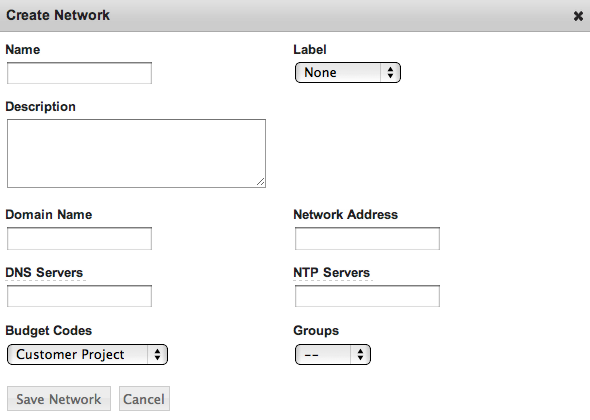
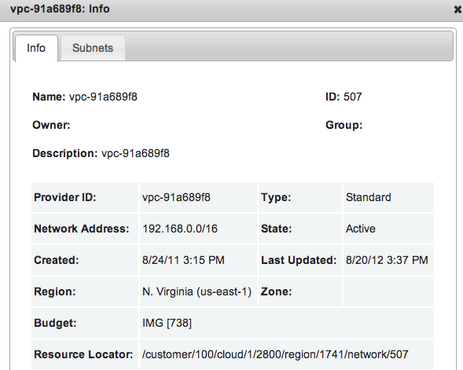

.. _networks:

Networks
--------

.. figure:: ./images/networksMain.png
   :alt: Network > Networks
   :width: 1284 px
   :height: 279 px
   :align: center
   :scale: 70 %

Summary
~~~~~~~

Select actions from the right-hand column to access
network options. This section describes the options available in the actions menu.

Create Network

To add a new network, select + Create Network. A dialogue will open:

Info
~~~~

To access expanded information regarding network attributes, select actions > Info.

Edit Subnets
~~~~~~~~~~~~

Selecting actions > Edit Subnets will open a new pane similar to the main Networks display. 

Delete
~~~~~~

Selecting actions > Delete will prompt for confirmation and then delete the selected subnet.
