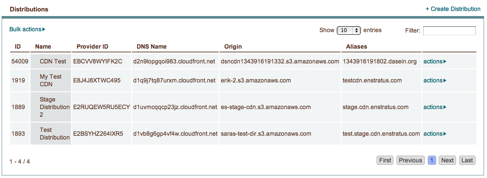
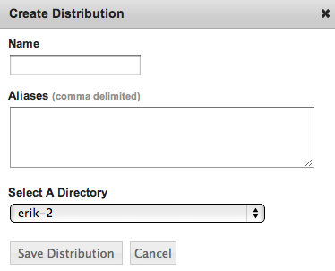

.. _saas_distributions:

Distributions
-------------

|

enStratus supports cloud-based content distribution networks or content delivery networks
(CDN) through enStratus Distributions. Distributions allow users to distribute content
from cloud storage quickly and efficiently to end users in the cloud.

enStratus currently supports Limelight Networks' CDN through the Rackspace cloud and the
Amazon Web Services CDN CloudFront. CloudFront allow users to distribute content from
Amazon S3 storage and Limelight Networks allows users to distribute content from Rackspace
Cloud Files.

Create a New Distribution
~~~~~~~~~~~~~~~~~~~~~~~~~

To create a new distribution in enStratus click on Platform > Distributions then click
+Create Distribution.

.. note:: To create a new distribution you must have a pre-existing directory in Platform >
 Files. See :ref:`next section <saas_cloudfiles>` for more information on files in enStratus.

The **Name** field is where you specify a custom domain name for your distribution. (e.g.
example.cloudfront.net)

The **Aliases** field allows you to map comma delimited aliases to the specific domain name.

The **Select A Directory** drop-down contains a list of all root-level directories located on
the Platform > Files page of the enStratus console. The directory that is selected for the
distribution is mapped to the domain name you created.

Other Actions
~~~~~~~~~~~~~

Clicking the actions tab next to your newly created distribution will provide you with the
options to edit, delete, or activate/deactivate the distribution.
