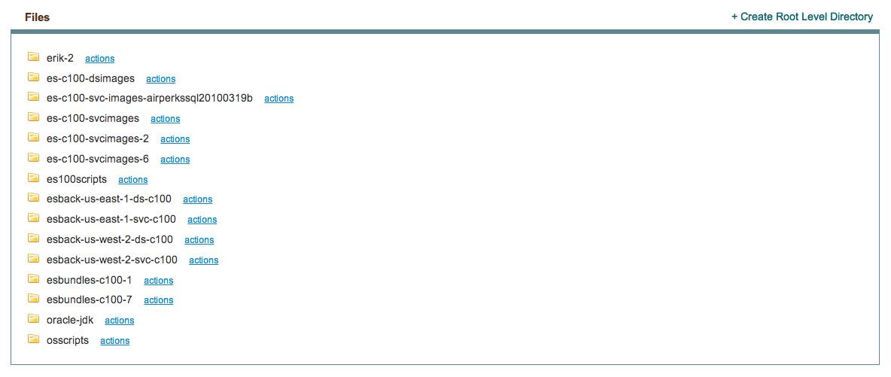
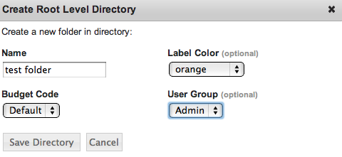

.. _saas_cloudfiles:

Files
-----

enStratus supports cloud file storage via the enStratus console. File storage allows users
to store and retrieve important data for easy and reliable access.

enStratus supports cloud file storage in Amazon Simple Storage Service (Amazon S3),
Windows Azure Storage Services, Google Storage, Eucalyptus Walrus, AT&T Synaptic Storage,
OpenStack Object Storage (Swift), and Rackspace Cloud Files.

To create a new bucket through the enStratus console click on Platform > Files, then click
on +Create Root Level Directory.

|

.. note:: You can create multiple root-level directories.

The **Name** field is for a custom name to associate with your directory.

The **Label** field helps you organize your directories by providing a unique color label.

**Budget Code** and **User Group** are the budget code and user group attributes that enStratus
will use to track billing charges and access rights tied to the user management and
budget code offerings of enStratus.

Once the directory is created you can create a hierarchy of directories within the
root-level directory. Clicking on the actions tab next to the root-level directory will
bring up options for that directory. These options include:

**Info**: Will provide information relating to the directory (e.g. directory name, user group,
date created, parent directory, etc.)

**Permissions**: You can set access level permissions to each directory.

**Upload Files**: You can upload files to the given directory from your local machine.

**New Directory**: Will create a new directory within the current working directory.

**Delete**: Will remove the directory and its contents.
