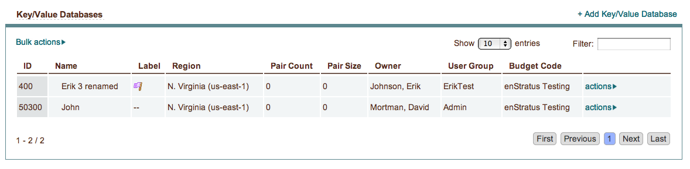
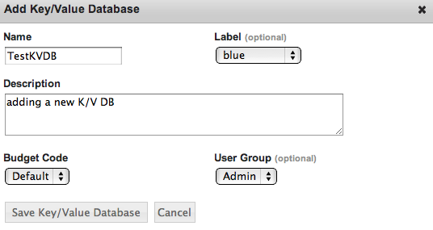

.. _saas_key_value:

Key Value Databases
-------------------

enStratus Key/Value Databases (KV Databases or KVDB) are a simple solution for storing
your data for high availability and scalability. With a KV database you get only what you
need. You can simply query your data and return the results without having to manage
different schemas for your stored data sets. You do not need to worry when storing new
data because it is automatically indexed for you.

Overview
~~~~~~~~
enStratus currently supports the creation and termination of Amazon SimpleDB domains. See
`Amazon SimpleDB <http://aws.amazon.com/simpledb>`_ for more information and current pricing.

KV databases are large collections of data organized into separate domains. The data is
stored in hash tables that contain key-to-value pairs. These pairs are
attributes that can be searched in lexicographical queries.

Creating a Key/Value Database
~~~~~~~~~~~~~~~~~~~~~~~~~~~~~

To launch a new KV database in the enStratus console select Platform > Key/Value
Databases. Then click  +Add Key/Value Database.

The **Name** field is for a custom name to associate with your database.

The **Description** field can be a custom description for your database.

The **Label** field helps you organize your KVDB instances by providing a unique color label.

**Budget Code** and **User Group** are the budget code and user group attributes that enStratus
will use to track billing charges and access rights tied to the user management and
budget code offerings of enStratus.

Upon save the KV database is launched. It can take up to 15 minutes to appear in the
enStratus console.

Terminating Key/Value Databases
~~~~~~~~~~~~~~~~~~~~~~~~~~~~~~~

To terminate a KVDB click actions > Terminate in the Key/Value Databases table.
