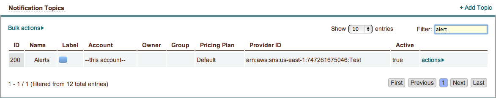
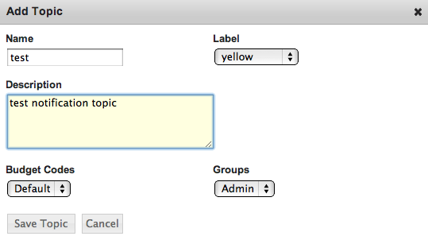
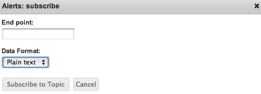

.. _saas_notification_topics:

Notification Topics
-------------------

|

enStratus supports management of cloud based notification topic web services through the
enStratus console. Notification topics are often applied to an application and can be used
to automatically send messages to subscribers or other applications.

Overview
~~~~~~~~

enStratus currently supports the creation and management of Amazon Simple Notification
Service (Amazon SNS). See `Amazon SNS <http://aws.amazon.com/sns>`_ for more information and current pricing.

Notification topics make it easy for developers to send out important messages to
applications or users. This allows developers to effectively communicate
time-sensitive information in the form of a message.

Creating Notification Topics
~~~~~~~~~~~~~~~~~~~~~~~~~~~~

Screenshot

To create a new Notification Topic click on Platform > Notification Topics, then click on
+Add Topic.

The **Name** field is for a custom name to associate with your topic.

The **Description** field can be a custom description for your topic.

The **Label** field helps you organize your topics by providing a unique color label.

**Budget Code** and **User Group** are the budget code and user group attributes that enStratus
will use to track billing charges and access rights tied to the user management and
budget code offerings of enStratus.

Upon save your topic will be created and will appear shortly.

Subscribing To Notification Topics
~~~~~~~~~~~~~~~~~~~~~~~~~~~~~~~~~~

After the topic has been created you can add subscribers to the topic by clicking on
actions > subscribe.

**End point** is where you can enter the end point as an email address, web services URL, or
the Amazon Resource Name string on a SQS (Simple Queue Service) queue.

**Data Format** is currently supported in JSON and plain text formats.

Clicking Subscribe to Topic will add the subscriber.

Publishing To Notification Topics
~~~~~~~~~~~~~~~~~~~~~~~~~~~~~~~~~

To publish a message to your subscribers click on actions > publish.

The **Subject** field can be any custom subject for your message.

The **Message** field will be where you provide your custom message.

Deleting Notification Topics
~~~~~~~~~~~~~~~~~~~~~~~~~~~~
To delete a notification topic click actions > delete in the Notification Topics table.
