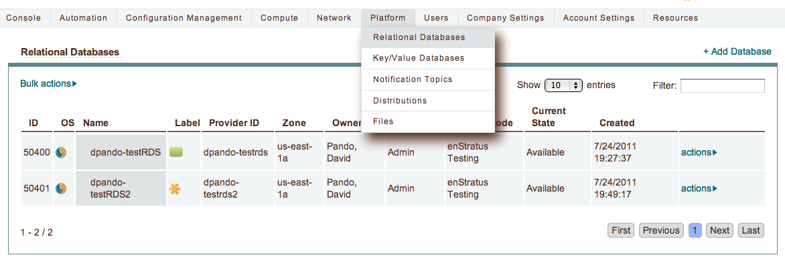

.. _saas_platform:

Platform
========

Many clouds support Platform-as-a-Service (PaaS) offerings such as cloud files/object
storage, databases, and content distribution systems. Accessing PaaS offerings using
enStratus is done via the Platform menu.

.. toctree::
   :maxdepth: 1
   :hidden:

   relational_databases
   key_value_databases
   notification_topics
   distributions
   files
