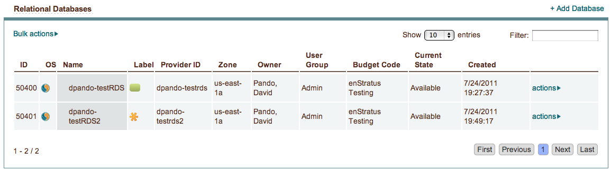
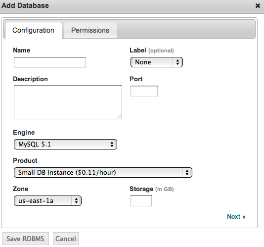
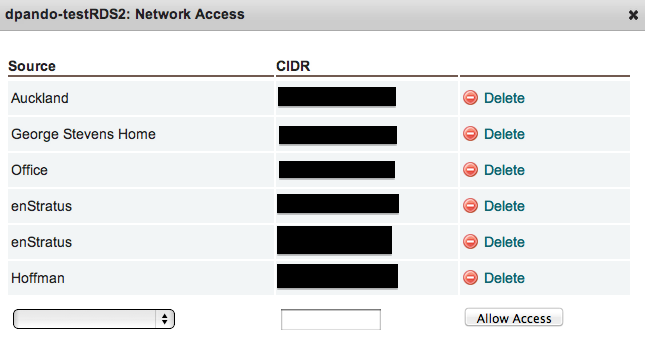
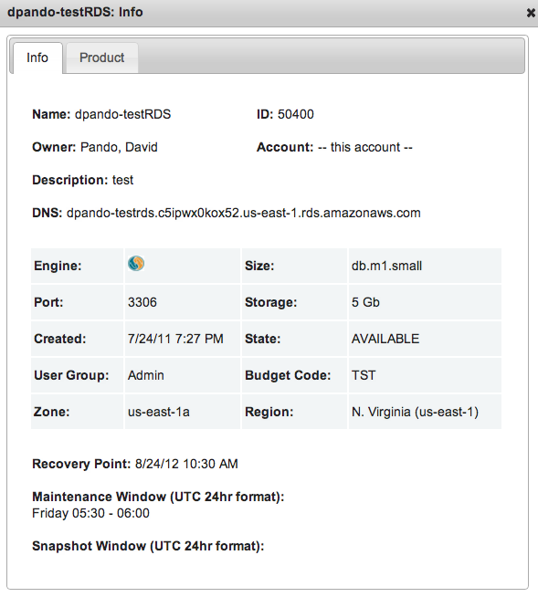

.. _saas_relational_database:

Relational Databases
--------------------

|

enStratus supports cloud-based relational database management services through enStratus
Relational Databases (RDBMS). This service allows the end user to operate, scale and
manage their relational databases in the cloud. Relational database instances give you the
full capabilities and features you would normally find on a familiar RDBMS.

Overview
~~~~~~~~

enStratus currently supports cloud based relational database management with Amazon
Relational Database Service (Amazon RDS). With a relational database instance you get the
functions of a traditional database, plus scalability and redundancy in the cloud.

Creating a Relational Database
~~~~~~~~~~~~~~~~~~~~~~~~~~~~~~

To create a new relational database in the enStratus console navigate to Platform >
Relational Databases. Click on +Add Database in the right corner of the table.

Under the configuration tab you will see the fields for creating a database.

The **Name** field is for a custom name to associate with your database.

The **Description** field can be a custom description of your database.

The **Label** field helps you organize your RDBMS instances by providing a unique color label.

The **Engine** field currently supports MySQL 5.1 relational databases. More options will be
provided as they become available.
[ARE THE ORACLE OPTIONS VIABLE?]

The **Product** field displays the different sizes available for the RDBMS and should be
chosen to fit your needs. Database operating costs are proportional to the size, measured
in compute power, of the provisioned datbase. See Amazon RDS for more information and
current pricing.

The **Port** number is restricted to ranges 1150 – 65535.

For the **Zone** field it is highly recommended that you choose a zone that is in the same
location as your primary application server.

.. note:: Another Zone option is `high availability`. In AWS this is know as a Multi-AZ deployment.
 The high availability option improves database durability and takes extra measures to
 ensure the RDBMS has minimal down time. This involves provisioning and maintaining a
 running backup of the primary instance in another zone. If there is planned maintenance,
 instance failure, or availability zone failure in the primary zone the RDBMS will
 automatically failover to the backup instance.

The **Size** you specify in the Storage field must be in the 5GB to 1TB range.

|

After the above fields have been completed proceed to the permissions tab:

.. figure:: ./images/addDBperms.png
   :width: 529 px
   :height: 331 px
   :scale: 90 %
   :alt: Add a Database
   :align: center

The **Admin User** and **Admin Password** fields are required.

**Budget Code** and **User Group** are the billing code and user group attributes that enStratus
will use to track billing charges and access rights tied to the user management and
billing code offerings of enStratus.

Upon save the RDBMS is launched and could take up to 15 minutes to show up in the
enStratus console.

Connecting to a Relational Database
~~~~~~~~~~~~~~~~~~~~~~~~~~~~~~~~~~~

First you need to allow connections between your local ip and the database you want to
connect to.

On the Platform > Relational Databases page, select actions > Network Access for the
database you want to use.

If you have created a network address (on the Company Settings > Network Addresses page)
for the IP you want to connect to your database from you can select your network address
from the Source drop-down. If you have not created a network address, you can either make a new
one on the Company Settings > Network Addresses page or you can type your CIDR in the CIDR
field and the Source will be labeled Custom. Click the Allow Access button and you will
have network access to the database in 5 minutes or less.

Next, view the info page for your database by selecting actions > Info. 

You can then connect to your database using a MySQL client, the Admin User, Admin Password
and Port you specified in the Create RDBMS form, and the DNS/Host specified in the Info
page.

Other Actions
~~~~~~~~~~~~~

To change the admin password for your relational database instance click on actions >
Change Password in the Relational Databases table. You can't change the admin user name,
but you can change the password by typing a new password in the Admin Password box and
clicking the "Change RDBMS Password" button.

To terminate a relational database instance click on actions > Terminate in the Relational
Databases table.
