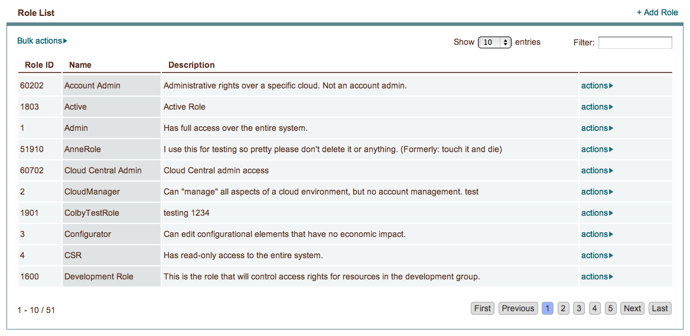
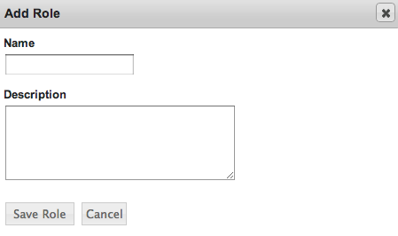
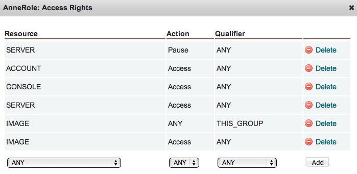

.. _saas_access_rights:

Roles
-----

How Roles Affect Users
~~~~~~~~~~~~~~~~~~~~~~

We've been saying that a user 'inherits' access rights from the role(s) assigned
to their group(s). Roles have very granular access control definitions
which are useful when defining the type and level of access users in a group should have.

Each role contains a customizable collection of access rights. Each access right provides 
some level of access to a certain element of the enStratus console.

The enforcement of these access controls is done through the enStratus console. A user may see a
limited set of options when clicking on the actions link for a cloud resource.

In the SaaS version of enStratus this is the method by which enStratus enforces access
controls.

In an on-premise deployment, customers may choose the option to completely hide cloud
resources to which a user has no access. Again, this enforcement is done through the 
enStratus console, except in this case if a user has no access to a cloud resource, the 
resource is not presented to the user.

Adding and Editing Roles
~~~~~~~~~~~~~~~~~~~~~~~~

Creating a new role in enStratus is straight-forward: select the +Add Role link in the upper-right
of the Role List pane; add a logical name and description.

Editing roles is also simple: select actions > Edit and you can change the role's name and
description.

Access Rights
~~~~~~~~~~~~~

The real power of the enStratus user security approach is unlocked when working with
Roles' Access Rights.

Select actions > Access Rights to add or edit the access rights for a role:

|

Definitions of terms used in the enStratus Access Rights dialogue:

**RESOURCE:** 

Every page, link and action in the enStratus console is controlled by at
least one resource. In most cases, resources correspond to pages. For example, access to
the actions available on the Compute > Machine Images page is controlled by the IMAGE resource and
access to the actions available on the Compute > Servers page is controlled by the SERVER resource.
Read access and account administration is controlled by the CONSOLE resource.

**ACTION:** 

Resources are divided into actions. If you want access to all actions within a
resource use the ANY action. If you want the role to have more granular permissions select
the specific actions you want users to be able to perform. For example, if you want users
with your role to be able to start deployments and services, add the Deployment-Launch action.
Some console actions require multiple resource-action pairs. These are documented in the
Important Combinations sections for each resource.[LINK]

**QUALIFIER:** 

There are five different qualifiers: ANY, GROUP, THIS GROUP, BILLING, and
MINE. These represent ownership of resources such as servers and machine images. For exam-
ple, when a user launches a server they can associate it with a group and a billing code.
The server that is launched is owned by the group and billing code assigned to it and the
user who launched it. With access rights you can limit access to the server to users who
belong to the group you chose, the chosen billing code, or the user who launched the
server.

If you want users in your role to have access to all servers you can use the ANY
qualifier. For some resources, such as console and firewall, the GROUP, THIS GROUP,
BILLING, and MINE qualifiers have no meaning because there is no ownership associated with
the resource. In these cases you should always use ANY when adding access rights.

Roles Example
~~~~~~~~~~~~~

You have three servers with the following ownership:

.. tabularcolumns:: |l|l|l|l|

+----------+------------+--------------+---------------+
| Resource | User Group | Budget Code  | Owner         |
+==========+============+==============+===============+
| Server 1 | QA         | Default      | Johnson, Erik |
+----------+------------+--------------+---------------+
| Server 2 | Dev        | Default      | Hoffman, Jeff |
+----------+------------+--------------+---------------+
| Server 3 | Dev        | Imaging      | Moselle, Greg |
+----------+------------+--------------+---------------+

|

*Objective* 

You are adding an access right to your QA Role, which is associated with your
QA Group, using the resource SERVER and the action Image. This is what each qualifier will
allow members of the QA group to do:

**ANY**   

QA users can image Server 1, Server 2, and Server 3.

**GROUP**   

QA users can image Server 1. They can image Server 2 and Server 3 only if they are
also members of the Dev group.

**THIS_GROUP**  

QA users can only image Server 1.

**BILLING** 

QA users can image Server 1 and Server 2 if they are associated with the
Default billing code. They can image Server 3 if they are associated with the Imaging
billing code.

**MINE**  

Erik can image Server 1, Jeff can image Server 2, and Greg can image Server 3.
