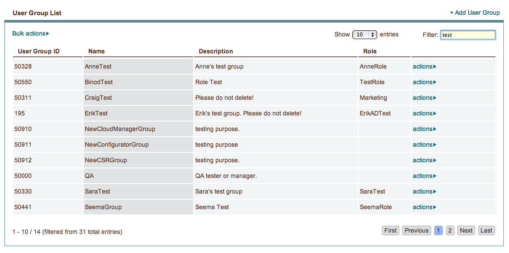
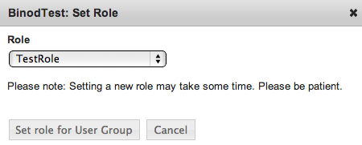

.. _saas_groups:

Groups
------

Working with groups in enStratus is straight-forward: create new groups by selecting +Add User Group from the upper right of the Users > Groups pane.
From there you will be prompted for a name and a description, which can both be altered later through the actions > Edit menu. Selecting
actions > Delete allows you to remove any unwanted groups.

To associate a group with a role, select actions > Set Role. The following dialogue will open:

The drop-down menu is populated from the list of Roles at Users > Roles. Select the appropriate role for your group.

