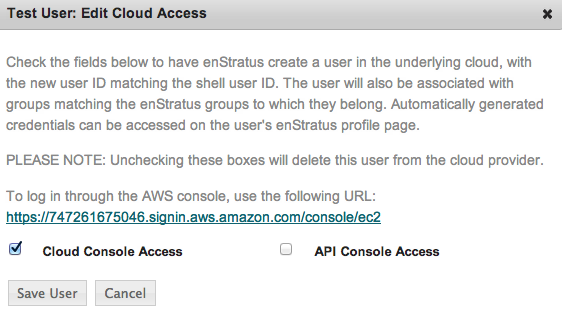

IAM
---

enStratus supports the Identity & Access Management (IAM) feature for Amazon and Eucalyptus cloud environments.
enStratus acts as a nexus through which authoritative user management is coordinated with
the cloud provider. The integrated IAM feature in enStratus allows an administrator user
of an account to securely control access to cloud console and api services and resources
for users in that particular account. 

Providing Cloud Console Access for enStratus Users
~~~~~~~~~~~~~~~~~~~~~~~~~~~~~~~~~~~~~~~~~~~~~~~~~~

There are two kinds of cloud console access an admin enStratus user can grant to users:

#. Cloud Console Access (Console Access using password)
#. API Console Access  (API Access using API keys)

.. note:: enStratus does not automatically generate Cloud Console Access and API Console
   Access when the user is created. In order to provide access, an admin user must manually
   grant access to the user from the user list page. 

Edit Cloud Access
~~~~~~~~~~~~~~~~~

Selecting actions > Edit Cloud Access prompt the user with
the following dialogue:

.. figure:: ./images/image09.png
   :width: 440 px
   :height: 318 px
   :scale: 95 %
   :alt: Users, Actions
   :align: center

|

Checking either one of the boxes for the first time and clicking the Save User button will
add the user to the cloud provider’s IAM user list. Unchecking the boxes will revoke the
user’s access to the cloud provider’s console. 

.. note:: Please wait about 2-3 minutes between adding and revoking accesses. Modifying the same user’s cloud access rapidly can result in a delay synchronizing with the cloud provider.

Cloud Console Access
~~~~~~~~~~~~~~~~~~~~

When only Cloud Console Access is checked and the user is saved, enStratus will generate a
login password which can be used by that user to login to the cloud provider (e.g. AWS)
console. 

|

An enStratus user who has been granted Cloud Console Access can check their Cloud Console
Password under the ‘Edit My Profile’ page.

.. figure:: ./images/image02.png
   :width: 378 px
   :height: 180 px
   :scale: 95 %
   :alt: Edit My Profile
   :align: center

|

The user will have the option to show or hide the console password.

.. figure:: ./images/image07.png
   :width: 393 px
   :height: 83 px
   :scale: 95 %
   :alt: Show Password
   :align: center

|

The account administrator should also provide the user with the url shown during the Edit Cloud Access dialogue.
(The url will take the following form:
 
https://<12-digit-number>.signin.aws.amazon.com/console/ec2 
where the 12-digit AWS Account Number can be found in the enStratus console at Account Settings > Amazon Web Services Provider Settings.)

For more AWS-specific information, see: 

http://aws.amazon.com/iam/faqs/#How_do_i_know_what_the_link_is

Then the enStratus user will have to provide the proper username,  which is the User ID
from the User List table in the enStratus console, and the Cloud Console Password, which
is displayed in the ‘Edit My Profile’ page of the enStratus Console. 

API Console Access
~~~~~~~~~~~~~~~~~~

Similarly when only the API Console Access is checked and the user is saved, enStratus
will generate API keys with the underlying cloud provider. 

.. figure:: ./images/image01.png
   :width: 434 px
   :height: 312 px
   :scale: 95 %
   :alt: API Access
   :align: center

|

An enStratus user who has been granted API Console Access can now find their API access
keys under ‘Edit My Profile’ page.

.. figure:: ./images/image00.png
   :width: 497 px
   :height: 158 px
   :scale: 95 %
   :alt: View API Keys
   :align: center

|

The enStratus user can use these keys to make API calls to the cloud provider.

If both of the boxes in the Edit Cloud Access form are checked, then the user is provided
with both Cloud API keys and a Cloud Console password, and they are both displayed under
the ‘Edit My Profile’ page. If both the boxes are unchecked while editing a user’s cloud
access then both kinds of access are revoked and credentials are removed from the ‘Edit My
Profile’ page.

.. note:: Generating a cloud console access password or API access keys for an enStratus user
   for the first time creates an IAM user with the enStratus User Id as their username in the
   cloud provider’s console **but does not attach a user policy to the user**. The user will not
   have any set of permissions associated with it which prevents the user from performing any
   actions in the cloud provider’s console. 

Adding User Policies
~~~~~~~~~~~~~~~~~~~~

In order to provide an IAM user with proper access rights, the admin enStratus user must
log into the cloud provider’s console and manually attach the proper user policy to the
IAM user.  

For example, for an IAM user in an Amazon cloud account:

The admin user will log on to AWS console and select the IAM tab to display the list of IAM users.

.. figure:: ./images/image04.png
   :width: 665 px
   :height: 231 px
   :scale: 95 %
   :alt: IAM Users, List
   :align: center

After the admin selects a user, a window below the IAM user list is displayed that allows
for modifying the user’s attributes. Selecting the Permissions tab from that window will
show the option to attach a user policy to a particular user. 

.. figure:: ./images/image08.png
   :width: 883 px
   :height: 235 px
   :scale: 95 %
   :alt: IAM Policy, Single User
   :align: center

A user can then be attached to different types of access rights based on the configuration
selected by an administrator.

.. figure:: ./images/image03.png
   :width: 671 px
   :height: 491 px
   :scale: 95 %
   :alt: Access Rights, Edit
   :align: center

After the user has been attached to an appropriate user policy, the user will be able to
log in to the AWS console and perform permissible actions and/or make permissible API
calls.

