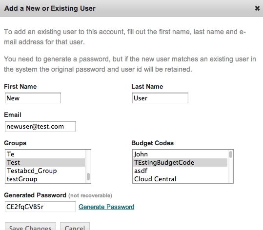
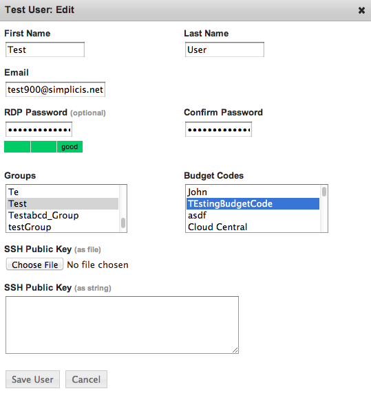

.. _saas_users_manage:

Users
-----

The challenge of user management breaks down roughly along two boundaries. The first of
which is enStratus console access and the second is access rights to an individual cloud
resource such as a server.

The elasticity inherent in cloud computing creates a unique challenge for enterprise shell
and remote desktop access. enStratus operates as an arbiter between your authoritative
user database and user access to cloud virtual machines. Because of this arbitration, your
cloud virtual machines do not need to participate in any kind of trust relationship with
a corporate directory service.

enStratus acts as this arbiter by adding individual user accounts to virtual machines
based on the user's enStratus access rights to that VM. enStratus maintains a separate set
of login credentials for VM access so that corporate passwords are never placed in a
public cloud.

Any enStratus user may be granted shell/remote desktop access to a cloud virtual machine
if that user has shell access rights to that virtual machine. If you want to grant a user
access to a virtual machine, they must have first created Linux (SSH) or Windows
(RDP Password) credentials in enStratus. You can then select the virtual machine to which they
should be granted access and then grant them access to the virtual machine. When you grant
that access, a new user account is created on the virtual machine with that user's
authentication credentials. [LINK TO SERVERS]

Add a User
~~~~~~~~~~

To create a new user or add an existing user to a new account, navigate to Users > Users. 
Click on the + add user link in the upper right of the User List and complete the resulting 
dialog box. After providing the required information the user will be added to the user list.

|

Once the user is added to the system, they will inherit the rights associated with the
group(s) to which they have been added.

Editing Existing Users
~~~~~~~~~~~~~~~~~~~~~~

.. figure:: ./images/image05.png
   :width: 412 px
   :height: 214 px
   :scale: 95 %
   :alt: Users > actions
   :align: center

|

A user must specify remote access credentials prior to gaining access to individual
running servers in the cloud. To gain access to a running Windows server, the user must
specify an RDP password. To access a Linux server, a user must specify a public SSH key.

Users can add these credentials for themselves by editing their profile in the enStratus
console (see LINK TO CONSOLE for details), but administrators can also add them to the
user's account.

To add credentials or edit other account details after a user is created, select
actions > Edit for their user ID.

|

Add credentials or change the user's profile details as needed.

.. note:: Users can belong to multiple groups and have multiple budget codes.

Editing Cloud Access
~~~~~~~~~~~~~~~~~~~~

For details on managing cloud access for users, see THE NEXT SECTION.

Reset Password
~~~~~~~~~~~~~~

Administrators can generate new passwords for existing users through actions > Reset Password.

Deactivate a User
~~~~~~~~~~~~~~~~~

If you remove the user from enStratus, enStratus removes all virtual machine access
as well.
