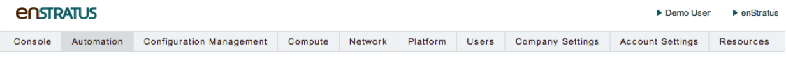

--------------------------
enStratus QuickStart Guide
--------------------------

Welcome to the enStratus QuickStart Guide. This guide will walk you through the 
necessary steps to setup your enStratus environment. While each step is not explictly required, they are recommended to get the most value from enStratus

Navigation
~~~~~~~~~~

The menu ribbon is the primary means to navigate the enStratus console. The menu is categorized wth submenus for each area.

Adding a Cloud Provider
~~~~~~~~~~~~~~~~~~~~~~~

The first step to getting started is to add a Cloud Provider Account. After you’ve registered your enStratus account, you’ll be presented with the following screen to add a Cloud Provider.

.. figure:: ./images/add_provider.png
   :height: 907px
   :width: 1125 px
   :scale: 75 %
   :alt: Add Cloud Provider
   :align: center

Select your Cloud Provider and then enter the appropriate API credentials. Please refer to your Cloud Provider’s documentation on where to obtain the API credentials. 

Building the Foundation
~~~~~~~~~~~~~~~~~~~~~~~

Before enStratus can begin to manage your Cloud assets, it is important to create the foundational base that will be used throughout the system.
The steps below will walk you through building the parts you need to quickly get started with enStratus. 

**1. Budget Codes**

Any time a Cloud service is requested from a Cloud Provider through enStratus it is required to be assigned to an enStratus Budget Code. By default, enStratus provides a “Default” Budget Code. To add a new Budget Code, follow the steps on `this page <http://docs.enstratus.com/budget/budget_codes.html>`_

**2. Users**

Users provide your team access to the enStratus console. To add new users follow the steps on `this page <http://docs.enstratus.com/users/user_profile.html>`_

**3. Roles**

Roles define the access controls that groups are given and are used to restrict components of the enStratus Console. To add new Roles follow the steps on `this page <http://docs.enstratus.com/users/roles.html>`_

**4. Groups**

Groups provide a mapping between Users and Roles and provide a logical grouping for Cloud Object. Learn how to add roles on `this page <http://docs.enstratus.com/users/groups.html>`_

**5. The enStratus Agent**

Once you've add the Budgets, Users, Roles, and Group you will need to setup your images with the enStratus agent. enStratus provides some images in various Cloud Providers with the enStratus agent already installed.
For Amazon Web Services, search for public images with the string "enStratus17" for the latest images with the agent installed.

The enStratus agent is required to preform advanced capabilites such as `Configuration Management <http://docs.enstratus.com/configuration_management/configuration_management.html>`_ or creation of `Deployments <http://automation.enstratus.com/>`_. To inject the enStratus agent, follow these steps:

  #. Launch an image of the desired OS. This can be an enStratus provided public image or your own image.
  #. Once the server has completed launching, `install the enStratus agent <http://agent.enstratus.com/>`_. If you used an enStratus provided public image, skip this step. 
  #. Verify that the agent is communicating with the enStratus system. Navigate to "`Compute->Servers <https://cloud.enstratus.com/page/1/infrastructure-servers.jsp>`_". Under the "Agent" Column, there should be a Yellow or Blue radio tower icon.
  #. Create a new image from this server. Click the actions menu, and choose "Make Image".
  #. Navigate to "`Compute->Machine Images <https://cloud.enstratus.com/page/1/infrastructure-images.jsp>`_". Once the image creation process is complete, the "Registered" column should have the enStratus logo for that image.

**6. Link in Chef or Puppet**

Now that you have an with the enStratus agent installed, you connect in your Chef or Puppet `configuration management <http://docs.enstratus.com/configuration_management/configuration_management.html>`_.  

Next Steps
~~~~~~~~~~

At this point, you should be ready to start using enStratus. Visit our `documentation <http://docs.enstratus.com/>`_ for more info, or complete the Adavance Automation `Tutorial <ihttp://tutorials.enstratus.com/wordpressdemo/wordpressdemo.html>`_ to learn more about the enStratus features.

  
