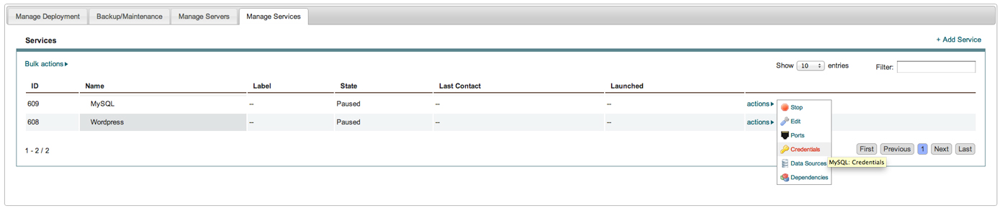
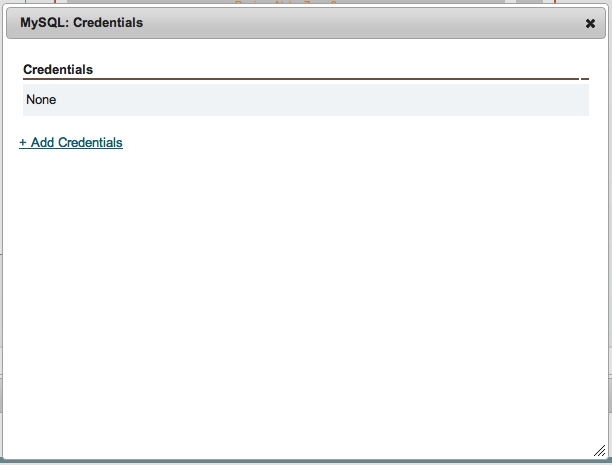
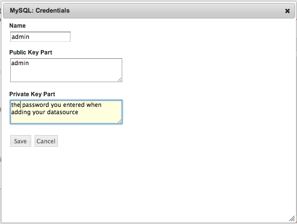
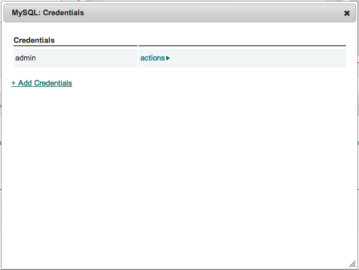

Credentials
-----------

The credentials option in the actions menu is to allow credentials or other private information to be passed directly to the running instance.

Click '+ Add Credentials'.

You need to fill MySQL credential configuration properly to initialize MySQL database.

.. list-table::
   :widths: 30 22 90
   :header-rows: 1

   * - Field
     - Value
     - Description
   * - Name
     - admin
     - You must use 'admin'. This name is used in enstratus service configuration scripts. This field won't be configurable in next update.
   * - Public Key Part
     - (username)
     - Any username you want. This field name must sound strange but this is the username for initializing MySQL database.
   * - Private Key Part
     - (password)
     - Any password you want.
|
After configuring credential, you will see the credential on the list.

